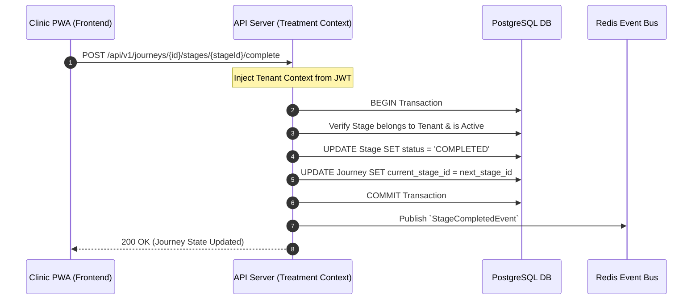
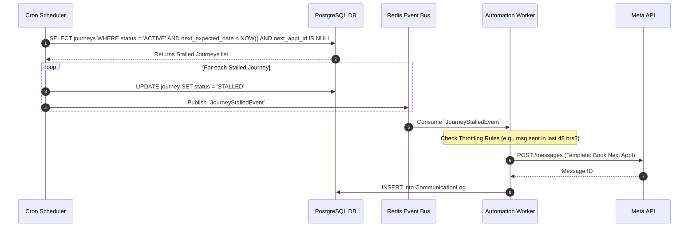

# Data & Event Flow Diagrams

This document details how data moves synchronously through the system and how asynchronous events trigger the core value proposition of DentalFlow: the automated WhatsApp nudge engine.

---

## 1. Core Data Flow: Journey Progression

The primary synchronous data flow in the system involves the Assistant or Dentist updating the state of a Patient's Journey.

### Synchronous Data Flow Diagram



**Key Data Characteristics:**
* **Strict ACID Compliance:** Database transactions must guarantee that a stage is not marked complete twice, and that the journey pointer cleanly moves to the next stage.
* **Tenant Isolation:** Every database query implicitly scopes to `tenant_id`.

---

## 2. Event-Driven Architecture (Asynchronous Automation)

DentalFlow relies heavily on background workers reacting to domain events. The API servers do not communicate directly with WhatsApp during a standard clinical workflow. They emit events, and the Worker Queue handles scheduling and delivery.

### 2.1. The "Stage Completed" Event Flow

When a stage is completed, the system needs to:
1. Immediately send post-op care instructions.
2. Calculate when the *next* stage should happen and schedule a reminder if the patient hasn't booked by then.

```mermaid
graph TD
    subgraph API Server
        Emit[Publish StageCompletedEvent]
    end

    subgraph Redis / BullMQ
        Bus((Event Bus))
        JobQ[[Delayed Job Queue]]
    end

    subgraph Background Workers (Communication Context)
        Worker1[Post-Op Handler]
        Worker2[Nudge Scheduler]
        WhatsApp[Meta Cloud API]
    end

    Emit -->|StageCompletedEvent| Bus
    
    Bus --> Worker1
    Worker1 -->|Fetch Post-Op Template| JobQ
    JobQ -->|Execute Now| WhatsApp
    
    Bus --> Worker2
    Worker2 -->|Calculate Default Interval<br/>e.g., +7 Days| JobQ
    JobQ -->|Delay: 7 Days| JobQ
    JobQ -->|Execute at T+7| WhatsApp
```

### 2.2. The "Stalled Journey" Event Flow

A CRON scheduler runs periodically (e.g., every hour) to scan for Journeys that have missed their expected scheduling window.



### 2.3. Inbound Appointment Request Flow (WhatsApp Webhooks)

When a patient interacts with an automated message (e.g., clicks a "Book Appointment" quick-reply button on WhatsApp), the flow is handled via incoming webhooks.

```mermaid
graph LR
    Patient((Patient on WhatsApp)) -->|Clicks 'Book Friday'| Webhook[Webhook Ingestion (API)]
    Webhook -->|Verify Signature| Parse[Payload Parser]
    Parse -->|Publish| EventBus((Redis))
    
    EventBus -->|InboundMessageEvent| SchedWorker[Scheduling Service]
    SchedWorker -->|Map WhatsApp # to Patient| DB[(PostgreSQL)]
    SchedWorker -->|Create ApptRequest| DB
    
    DB -.->|PWA Polling / WebSocket| Receptionist((Clinic Assistant))
```
