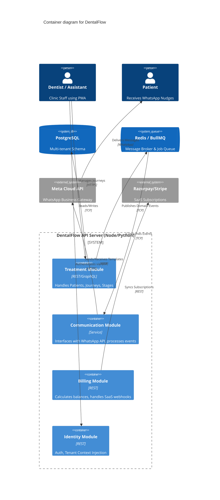

# Domain Architecture & Bounded Contexts

This document outlines the Domain-Driven Design (DDD) architecture for DentalFlow, establishing the bounded contexts, aggregate roots, and service boundaries that dictate how the application is structured.

---

## 1. Domain Architecture Overview

DentalFlow operates primarily in the healthcare scheduling and patient engagement domain, but with a unique twist: it is **treatment-centric** rather than appointment-centric.

### Domain Classification
* **Core Domain:** Treatment Journey & Stage Management. This is where DentalFlow differentiates itself from competitors.
* **Supporting Domains:** WhatsApp Communication, Next Visit Suggestions.
* **Generic Subdomains:** Identity Management, Tenant Isolation, SaaS Billing, Basic Calendar Scheduling.

---

## 2. Bounded Contexts

To maintain a modular monolith (or microservices) architecture, the system is divided into four primary Bounded Contexts.

### Context Map

```mermaid
graph TD
    subgraph Identity Context
        Tenant
        UserRole
        ClinicProfile
    end

    subgraph Treatment Context
        Patient
        TreatmentTemplate
        TreatmentJourney
        TreatmentStage
        Appointment
    end

    subgraph Communication Context
        WhatsAppTemplate
        MessageLog
        AppointmentRequest
    end

    subgraph Billing Context
        PaymentRecord
        RevenueBalance
        UPIQRCode
        SaaSSubscription
    end

    Identity Context -->|Provides Auth/Tenant context| Treatment Context
    Identity Context -->|Provides Auth/Tenant context| Communication Context
    Treatment Context -->|Triggers events| Communication Context
    Treatment Context -->|Registers Stage Cost| Billing Context
    Identity Context -->|Clinic limits| Billing Context
```

### 2.1. Treatment Context (Core)
The absolute core of DentalFlow. It manages the clinical hierarchy.
* **Aggregate Roots:**
  * `Patient` (Holds basic demographics and WhatsApp opt-in status).
  * `TreatmentJourney` (An active instance of a treatment for a patient).
  * `TreatmentTemplate` (The blueprint definition configured by the clinic).
* **Entities & Value Objects:**
  * `TreatmentStage` (Belongs to a Journey).
  * `Appointment` (Belongs to a Stage).

### 2.2. Communication Context (Supporting)
Handles all external nudges and webhook ingestion from Meta/WhatsApp.
* **Aggregate Roots:**
  * `CommunicationLog` (Record of messages sent/received).
  * `AppointmentRequest` (Self-scheduling request initiated by a patient via WhatsApp).
* **Entities:**
  * `WhatsAppTemplate` (Meta-approved text variables).

### 2.3. Identity & Tenant Context (Generic)
Secures the multi-tenant SaaS.
* **Aggregate Roots:**
  * `Tenant` (The Clinic boundary).
  * `User` (Dentist or Assistant).
* **Responsibilities:**
  * JWT/Session generation.
  * Clinic Leave Mode toggles (affects the Communication context).

### 2.4. Billing & Revenue Context (Generic)
Tracks financial progress at the journey level.
* **Aggregate Roots:**
  * `PaymentRecord` (Ledger of money received against a journey).
  * `SaaSSubscription` (The clinic's tier with DentalFlow - Lite, Growth, Enterprise).
* **Entities:**
  * `UPIQRCode` (Dynamic object generated for stage payment collection).

---

## 3. Service Boundaries & API Structure

DentalFlow will follow a **Modular Monolith** architecture for its initial MVP to reduce DevOps complexity for solo dentist deployments, while keeping bounded contexts strictly separated by internal APIs or event buses.



### Dependency Rules
* Modules can only communicate synchronously via defined internal interfaces.
* Asynchronous communication (e.g., triggering a WhatsApp message when a Stage is completed) must happen via the Event Bus (Redis/BullMQ) to prevent the Treatment Context from knowing the implementation details of the Communication Context.
