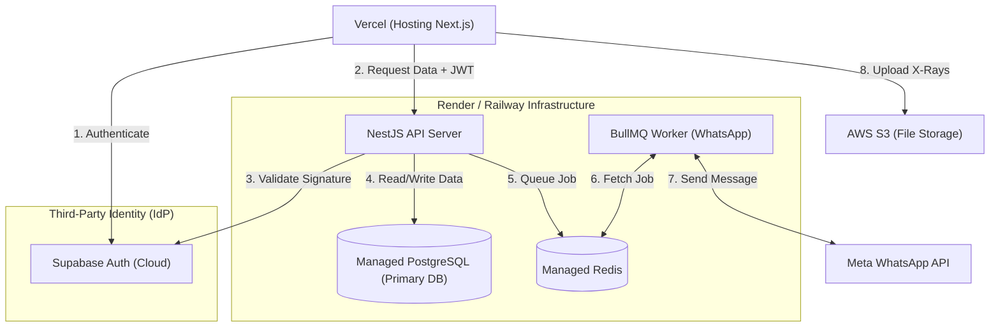

# Infrastructure Finalization: Supabase vs. Managed PostgreSQL

**Subject:** Clarifying the role of Supabase in the DentalFlow stack.

---

## 1. The Decision

**Decision:** Supabase is being used **ONLY for Authentication** (as an Identity Provider, similar to Auth0 or Clerk). 

The primary application database will be a completely separate, standard PostgreSQL instance (e.g., hosted on AWS RDS, Railway, or Render).

---

## 2. The Final Infrastructure Diagram

---

## 3. Why this is the Best Choice for a Solo Founder

It might seem tempting for a solo founder to use Supabase Postgres as the primary application database to save money and consolidate dashboards. However, using Supabase strictly for Authentication is the safer, more scalable choice for our specific architecture:

### 3.1. Avoiding the "Native RLS" Trap
Supabase's core selling point is that the frontend can query the database directly, protected by native PostgreSQL Row-Level Security (RLS) policies. 
However, as decided in our **PostgreSQL RLS Evaluation**, we explicitly rejected native SQL RLS because it forces you to write complex SQL migrations and causes severe connection pooling issues. We chose **Application-Level RLS using NestJS, AsyncLocalStorage, and Prisma**. 
If you use Supabase Postgres but bypass their native RLS features, you are paying for an ecosystem you aren't using.

### 3.2. Cloud Agnosticism & Vendor Lock-in
By treating Supabase exactly like Auth0 (strictly for Identity), your core business logic and primary database remain 100% cloud-agnostic. 
If you ever want to move your NestJS app and PostgreSQL database to a secure, HIPAA-compliant AWS environment, you simply migrate your Postgres data. You don't have to untangle your business data from Supabase's internal `auth` schemas.

### 3.3. Separation of Concerns
Identity (Passwords, MFA, Session Hijacking) requires entirely different backup, security, and compliance protocols than Clinical Data (Patients, Appointments, Treatment Stages). Keeping the primary database completely isolated from the Identity Provider ensures that a vulnerability in your application code cannot accidentally expose the password hashes of your users.

**Conclusion:** Treat Supabase exactly like a plug-and-play Authentication service. Keep your clinical PostgreSQL database pure, separate, and fully managed by Prisma.
