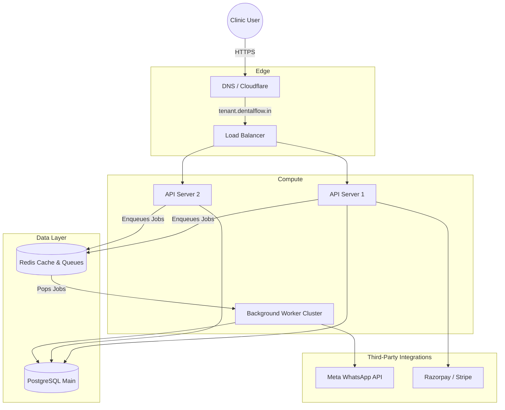

# SaaS Architecture & Multi-Tenant Design

This document details the high-level cloud architecture and the data isolation strategies used to securely operate DentalFlow as a Multi-Tenant Software as a Service (SaaS).

---

## 1. High-Level SaaS Architecture

DentalFlow is designed for high availability and low latency, ensuring that automated background tasks (like WhatsApp messaging) do not impact the performance of the clinic-facing web dashboards.

### Infrastructure Diagram



---

## 2. Multi-Tenant Data Isolation

Handling multiple clinics in a single database requires a robust isolation strategy to prevent cross-tenant data leaks. Since dental records carry implicit privacy expectations, standard application-level filtering is insufficient.

### Isolation Strategy: Row-Level Security (RLS) in PostgreSQL

We will utilize a **Single Database, Shared Schema** approach augmented by **PostgreSQL Row-Level Security (RLS)**.

1. **Why RLS?**
   * *Scalability:* Managing hundreds of schemas (schema-per-tenant) adds massive overhead to database migrations and connection pooling.
   * *Security:* RLS enforces the `tenant_id` filter at the database engine level. Even if a developer writes `SELECT * FROM patients`, PostgreSQL will only return rows where `tenant_id` matches the session variable.

2. **How it works:**
   * Every table (e.g., `patients`, `journeys`, `appointments`) has a `tenant_id` column.
   * Upon API request, the auth middleware extracts the `tenant_id` from the user's JWT.
   * The application sets a local PostgreSQL variable for that transaction:
     ```sql
     SET LOCAL app.current_tenant_id = 'uuid-of-clinic';
     ```
   * RLS policies automatically filter queries:
     ```sql
     CREATE POLICY tenant_isolation_policy ON patients
     USING (tenant_id = current_setting('app.current_tenant_id')::uuid);
     ```

### Tenant Context Flow Diagram

```mermaid
sequenceDiagram
    participant App as Clinic PWA
    participant LB as API Gateway (Nginx/Traefik)
    participant Auth as Auth Middleware
    participant DB as PostgreSQL (RLS)

    App->>LB: GET /api/v1/patients (Header: Host=shenoy.dentalflow.in)
    LB->>Auth: Pass request + JWT
    Note over Auth: Extract TenantID from JWT<br/>Validate Subdomain matches JWT
    Auth->>DB: BEGIN; SET LOCAL app.current_tenant_id = 'shenoy-uuid';
    Auth->>DB: SELECT * FROM patients;
    Note over DB: Engine applies RLS Policy
    DB-->>Auth: Returns only Shenoy Clinic Patients
    Auth->>App: 200 OK JSON
```

---

## 3. Subdomain Resolution & Routing

DentalFlow uses dynamic subdomains (e.g., `shenoy.dentalflow.in`) to provide a personalized feel for the clinics and assist in tenant identification.

* **Wildcard DNS:** A wildcard DNS record (`*.dentalflow.in`) points to the Load Balancer.
* **Frontend Handling:** The React application checks `window.location.hostname`. It parses the subdomain and uses it to brand the login page (e.g., "Welcome to Shenoy Dental").
* **Backend Verification:** While the subdomain provides UX benefits, actual data authorization is **strictly tied to the JWT**. A user attempting to access `others.dentalflow.in` with a JWT from `shenoy.dentalflow.in` will be rejected by the Auth Middleware.

---

## 4. Subscription & Billing Integration

Clinic subscriptions dictate their feature access and API usage limits.

* **Gateway:** Razorpay (preferred for India due to superior UPI & mandate support).
* **Billing Tiers:**
  * **Lite:** Capped at 100 active journeys/month.
  * **Growth:** Unlimited journeys, automated WhatsApp.
* **Webhook Sync:** Razorpay webhooks notify DentalFlow of successful/failed recurring payments.
  ```mermaid
  graph LR
      Razorpay -->|POST /webhooks/billing| API[Billing Service]
      API -->|Update Status| DB[(PostgreSQL)]
      DB -->|Suspend Access if Failed| Auth[Auth Middleware]
  ```
* **Suspension:** If a SaaS payment fails, the `Tenant` status is changed to `SUSPENDED`. The Auth Middleware will return a `402 Payment Required` for all API calls, and background workers will skip processing WhatsApp nudges for that tenant until the balance is cleared.
