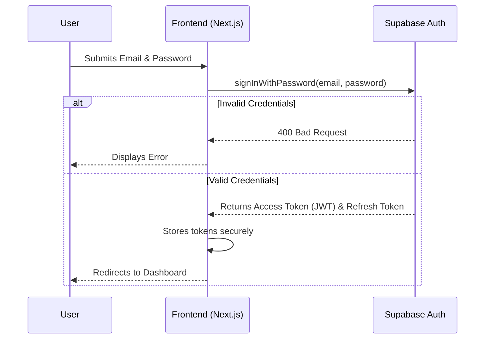
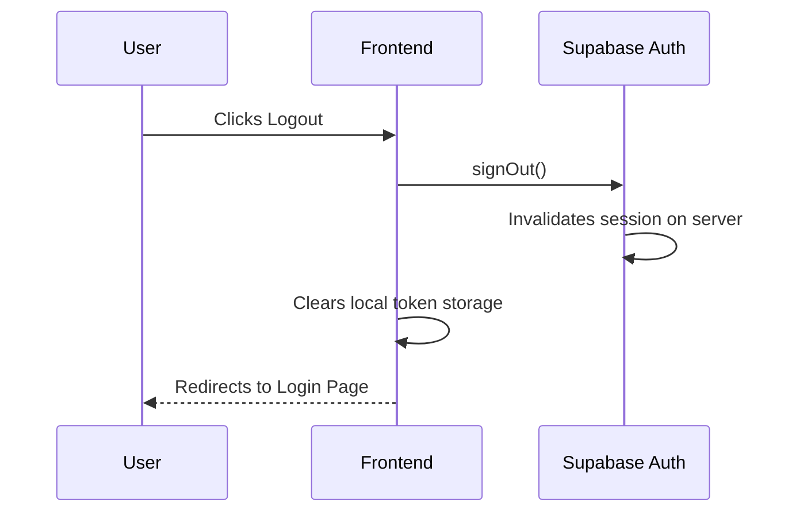
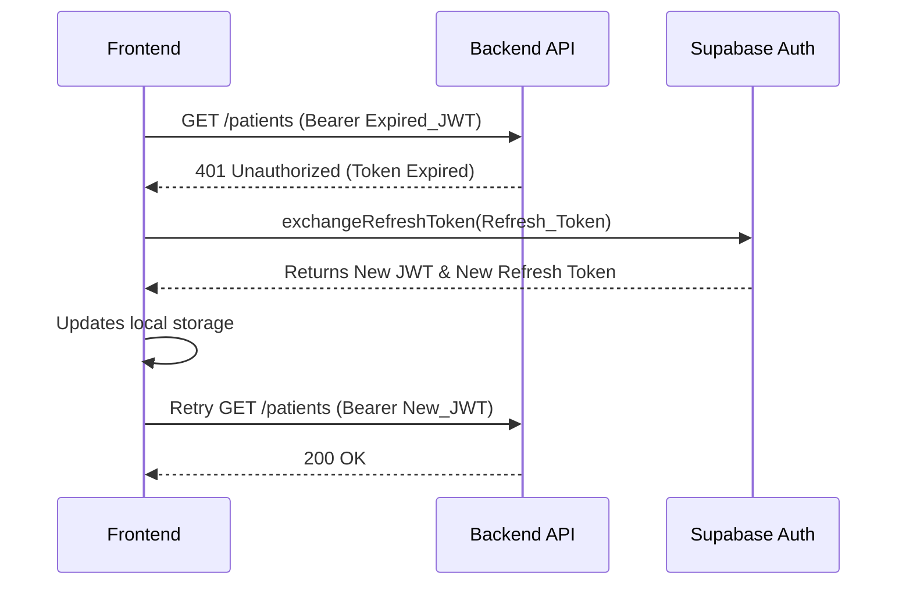
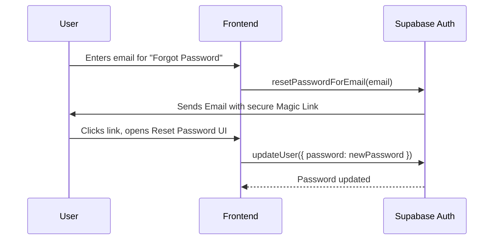
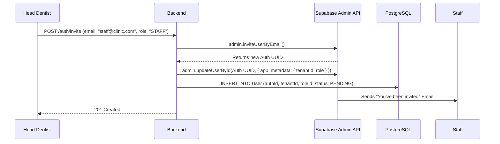
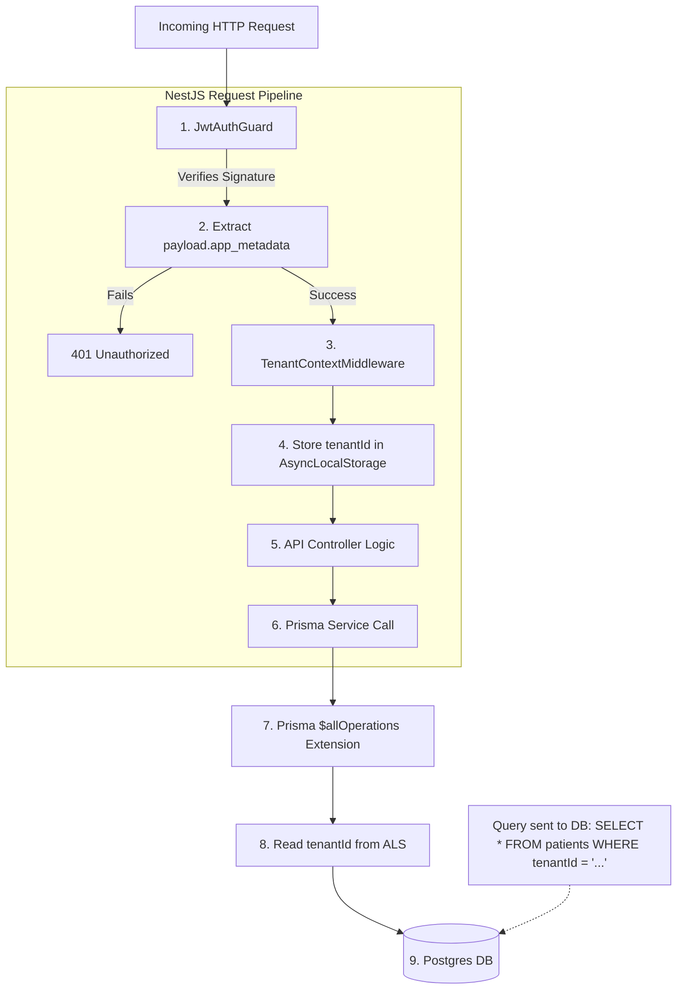

# STAGE 13 — Comprehensive Authentication Architecture

**Role:** Lead Architect / Staff Engineer
**Context:** DentalFlow SaaS Platform
**Stack:** Next.js, NestJS, Supabase Auth, Prisma, PostgreSQL

This document serves as the definitive architectural blueprint for Authentication and Authorization within DentalFlow.

---

## 1. Authentication Goals

1.  **Zero Local Secrets:** The NestJS backend will never store or process raw passwords. Identity verification is 100% offloaded to Supabase Auth.
2.  **Stateless Scalability:** The backend will not store session state in a database. It will rely purely on cryptographic JWT validation, allowing the API servers to scale horizontally.
3.  **Airtight Multi-Tenancy:** Cross-tenant data leaks must be cryptographically impossible. A user's `tenantId` is stamped into their JWT by the Identity Provider, preventing frontend tampering.
4.  **Frictionless Development:** By using Supabase for the heavy lifting (MFA, Magic Links, Passwords), engineering effort is preserved for the clinical core product.

---

## 2. User Lifecycle

1.  **Invited (Pending):** An Auth UUID is generated by Supabase, and a Prisma `User` record is created. The user has not yet set a password.
2.  **Active:** The user has clicked the Magic Link, set a password, and has a valid session.
3.  **Suspended / Inactive:** The user was terminated by the Head Dentist. Their Supabase identity is banned (invalidating active sessions), and their Prisma record is flagged `INACTIVE`.
4.  **Deleted:** Hard deletion from Supabase to comply with data privacy regulations.

---

## 3. Login Flow

Supabase manages the authentication state on the frontend.

---

## 4. Logout Flow

---

## 5. Refresh Token Flow

Access tokens (JWTs) are intentionally short-lived (e.g., 1 hour) for security. Refresh tokens are long-lived (e.g., 30 days) and used to get new Access tokens seamlessly.

---

## 6. Password Reset Flow

NestJS is completely bypassed.

---

## 7. Staff Invitation Flow

NestJS orchestrates this flow to ensure the Supabase Identity Vault and the Prisma Database stay in perfect sync.

---

## 8. JWT Lifecycle

1.  **Issuance:** Created exclusively by Supabase upon successful login or refresh.
2.  **Storage:** Stored on the frontend client.
3.  **Transmission:** Sent in the `Authorization: Bearer <token>` header to NestJS.
4.  **Verification:** NestJS uses `@nestjs/passport` and the Supabase public secret to mathematically verify the signature. No network call is made.
5.  **Expiration:** The JWT expires after a short period (1 hour). If stolen, the window of vulnerability is extremely narrow.

---

## 9. Tenant Extraction Lifecycle (Request Flow Diagram)

This is the most critical pipeline for securing the Multi-Tenant architecture.

---

## 10. Security Threats

1.  **Cross-Tenant Data Leak (Tenant Spoofing):** A malicious actor attempts to read another clinic's patients by changing a frontend dropdown or API parameter.
2.  **Token Theft (XSS):** An attacker injects malicious JavaScript into the frontend to steal the JWT from LocalStorage.
3.  **Stale Access Rights:** A terminated employee still has an active JWT that hasn't expired yet.
4.  **Replay Attacks:** An attacker intercepts a valid API request and resends it multiple times.

---

## 11. Security Mitigations

1.  **Mitigation for Tenant Spoofing:** We do not trust HTTP headers for `tenantId`. The `tenantId` is embedded inside the Supabase JWT `app_metadata`. Because the JWT is cryptographically signed, if an attacker tampers with the payload, the signature breaks, and the NestJS `JwtAuthGuard` instantly rejects the request.
2.  **Mitigation for Token Theft:** Instead of LocalStorage, tokens should be stored in `Secure`, `HttpOnly` cookies managed by Next.js Server Actions or API routes, preventing JavaScript from accessing the tokens.
3.  **Mitigation for Stale Rights:** When an employee is fired, NestJS calls Supabase's Admin API to instantly ban the user's `Auth UUID`. Banning a user invalidates their session globally, even if their JWT hasn't expired yet, because Supabase checks ban status during the token refresh cycle (and we can configure the backend to occasionally check revocation lists for highly sensitive endpoints).
4.  **Mitigation for Replay Attacks:** Enforce strict HTTPS/TLS 1.3 so traffic cannot be intercepted. Implement rate limiting on the NestJS backend to block aggressive identical requests.
