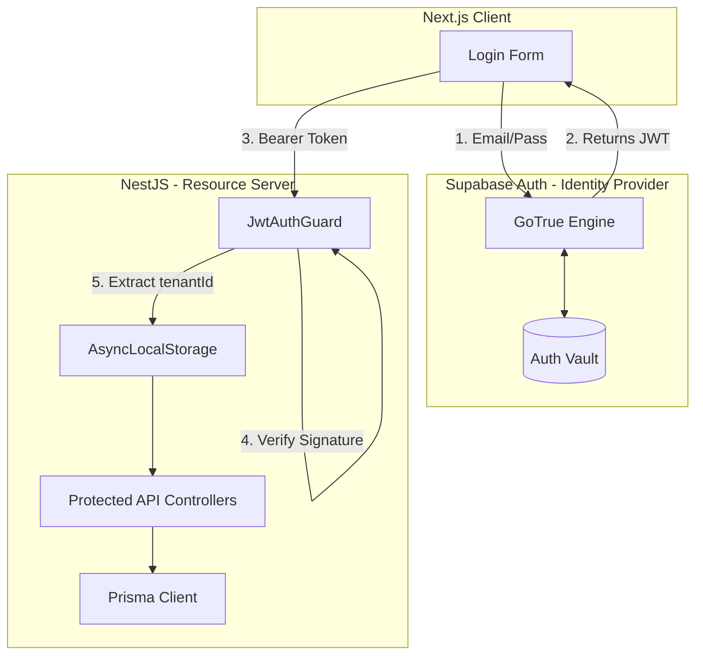
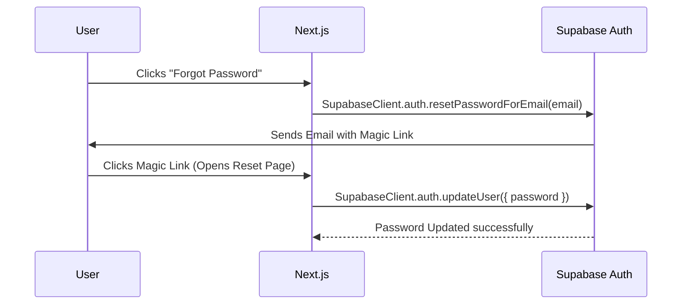
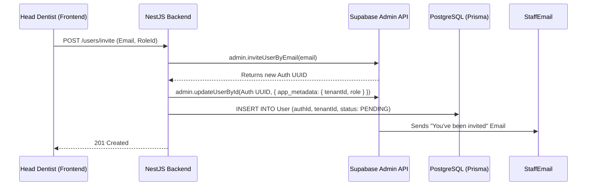
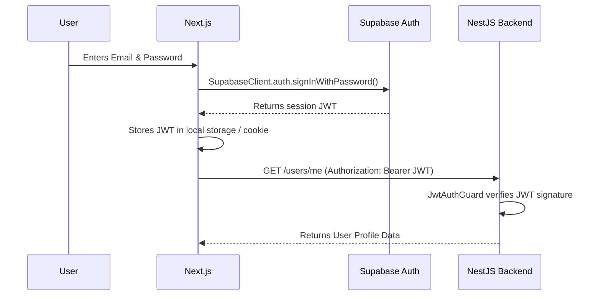

# Stage 13: Authentication Module Design

**Subject:** Complete design for the Authentication and Authorization lifecycle.
**Architecture:** Supabase Auth (IdP) + NestJS (Resource Server)

---

## 1. Authentication Architecture

The core philosophy is that **NestJS handles zero passwords**. All cryptographic identity management is offloaded to Supabase Auth. NestJS acts strictly as a Resource Server that verifies the signatures of the JWTs issued by Supabase.



---

## 2. JWT Verification & Tenant Extraction Strategy

When Supabase issues a JWT, it includes custom claims inside the `app_metadata` object.

### 2.1. The JWT Payload
```json
{
  "aud": "authenticated",
  "sub": "auth-uuid-1234",
  "email": "doctor@clinic.com",
  "app_metadata": {
    "tenantId": "tenant-uuid-5678",
    "role": "DENTIST"
  }
}
```

### 2.2. The Extraction Strategy
1.  **Passport JWT Strategy:** NestJS uses `@nestjs/passport` with the `ExtractJwt.fromAuthHeaderAsBearerToken()` strategy.
2.  **Signature Verification:** The strategy verifies the token against the `SUPABASE_JWT_SECRET` stored in the backend `.env` file. It does *not* need to make a network call to Supabase to verify the token.
3.  **Context Injection:** A custom middleware reads `req.user.app_metadata.tenantId` and sets it inside Node's `AsyncLocalStorage` so Prisma can seamlessly append it to all queries.

---

## 3. Database Entities

Although Supabase stores the actual email and password hash, we must maintain a synchronized `User` table in our primary PostgreSQL database to link users to clinical data (like "who scheduled this appointment?").

```prisma
// schema.prisma

model User {
  id        String   @id @default(dbgenerated("gen_random_uuid()")) @db.Uuid
  authId    String   @unique // The Supabase 'sub' UUID
  tenantId  String   @db.Uuid
  roleId    String   @db.Uuid
  firstName String
  lastName  String
  status    UserStatus @default(ACTIVE) // ACTIVE, PENDING, INACTIVE
  
  tenant    Tenant   @relation(fields: [tenantId], references: [id])
  role      Role     @relation(fields: [roleId], references: [id])
  
  @@index([tenantId])
}

model Role {
  id          String   @id @default(dbgenerated("gen_random_uuid()")) @db.Uuid
  tenantId    String   @db.Uuid // Roles can be customized per clinic
  name        String   // "DENTIST", "STAFF"
  
  users       User[]
  permissions Permission[]
}

model Permission {
  id        String   @id @default(dbgenerated("gen_random_uuid()")) @db.Uuid
  roleId    String   @db.Uuid
  action    String   // "CREATE", "READ", "UPDATE", "DELETE"
  subject   String   // "PATIENT", "INVOICE", "APPOINTMENT"
  
  role      Role     @relation(fields: [roleId], references: [id])
}
```

---

## 4. Guards and Decorators

To enforce granular Role-Based Access Control (RBAC), we define custom decorators to evaluate the `Permission` records.

### `@RequirePermissions()`
A decorator placed above controller endpoints to dictate what access is required.

**Usage Example:**
```typescript
@Get('/billing/invoices')
@UseGuards(JwtAuthGuard, PermissionsGuard)
@RequirePermissions({ action: 'READ', subject: 'INVOICE' })
async getInvoices() { ... }
```

### `PermissionsGuard`
A custom NestJS Guard that runs after the `JwtAuthGuard`. It looks at the user's `roleId`, fetches the associated `Permission` records from the database (or a fast Redis cache), and compares them to the `@RequirePermissions` metadata. If there is no match, it throws a `403 Forbidden`.

---

## 5. API Endpoints & DTOs

Because login is handled by the Supabase SDK on the frontend, our backend endpoints focus purely on *managing* users.

### 5.1. Endpoints
*   `GET /users/me` -> Returns the Prisma `User` profile of the current token holder.
*   `GET /users` -> Lists all staff within the `tenantId`.
*   `POST /users/invite` -> Triggers the Supabase invitation flow.
*   `PATCH /users/:id/status` -> Deactivates or activates a user.

### 5.2. DTOs
```typescript
// InviteUserDto
{
  email: string;       // "reception@clinic.com"
  firstName: string;   // "Jane"
  lastName: string;    // "Doe"
  roleId: string;      // UUID of the "STAFF" role
}
```

---

## 6. Core User Flows

### 6.1. Password Reset Flow
NestJS is entirely bypassed for this flow, minimizing backend complexity.



### 6.2. Staff Invitation Flow
NestJS acts as the orchestrator to ensure the Supabase identity and the Prisma database record are perfectly synced.



### 6.3. Login Flow

