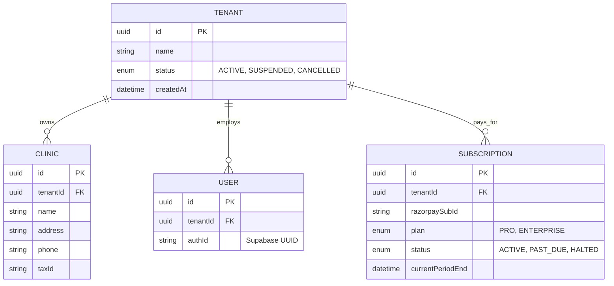
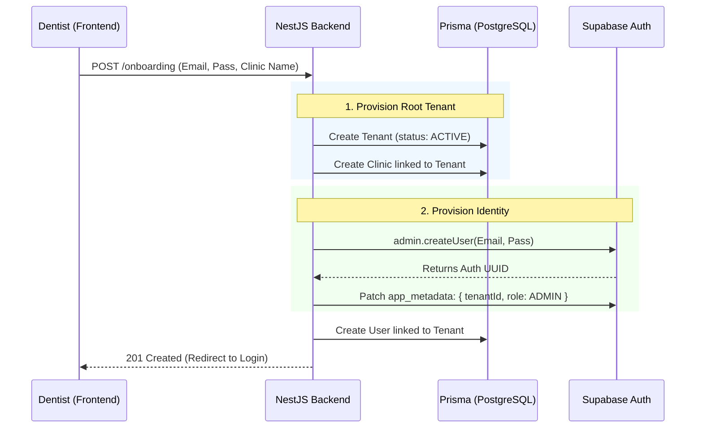
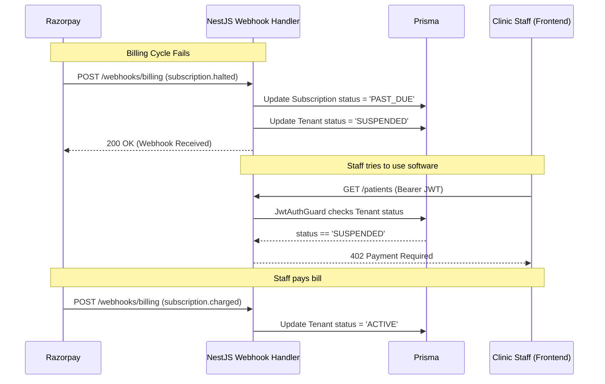

# STAGE 16 — Clinic Module Architecture

**Role:** Principal SaaS Architect
**Subject:** Clinic (Tenant) & Subscription Lifecycle Management
**Constraint:** No implementation code.

---

## 1. Architectural Philosophy & Design Decisions

### 1.1. Tenant as the Root Entity
**Decision:** Every core clinical entity (Patient, Appointment, Invoice) must belong to a `Tenant`, not a `Clinic`. 
**Why:** While "Clinic" is the physical location, "Tenant" is the logical billing and data-isolation boundary. By treating `Tenant` as the absolute root, we allow a future feature where a single `Tenant` (a franchise owner) can manage multiple physical `Clinics` under one billing umbrella.

### 1.2. Subscription State Drives Access
**Decision:** The global `JwtAuthGuard` will automatically block API requests if the user's `Tenant` status is `SUSPENDED` or `CANCELLED`.
**Why:** A solo founder cannot manually chase down clinics for unpaid SaaS bills. If Razorpay sends a webhook that a subscription failed, the backend automatically flips the Tenant status to `SUSPENDED`. The very next API call made by *any* staff member at that clinic will return `402 Payment Required`, instantly freezing the clinic until they update their credit card.

---

## 2. Database ERD (Entity-Relationship Diagram)

---

## 3. Lifecycles & Sequence Diagrams

### 3.1. Clinic Onboarding Lifecycle
**Flow:** A new dentist creates their account, which provisions the Tenant, the default Clinic, and the initial User Identity.

### 3.2. Subscription Lifecycle (Suspension & Reactivation)
**Flow:** The clinic's credit card fails. Razorpay notifies our backend via a Webhook. We suspend the Tenant.

---

## 4. API Contract Definitions

### `POST /api/onboarding`
*   **Purpose:** Initial self-serve registration for new clinics.
*   **Request Body:** `email`, `password`, `clinicName`, `phone`.
*   **Validation:** `@IsEmail`, Password strength regex, `@IsString`.
*   **Response:** `201 Created`. `tenantId` and `clinicId`.
*   **Security:** Rate-limited to prevent automated spam account creation.

### `GET /api/clinics`
*   **Purpose:** Fetch details of the clinic(s) the current user belongs to.
*   **Validation:** Header `Authorization: Bearer <JWT>`.
*   **Response:** `200 OK`. Array of Clinic objects.
*   **Security:** Controller uses `@CurrentUser()` to strictly filter query by `tenantId`.

### `PATCH /api/clinics/:id`
*   **Purpose:** Update physical clinic details (Address, Phone, Tax ID).
*   **Validation:** `address` (String), `taxId` (String).
*   **Response:** `200 OK`.
*   **Security:** Requires `@RequirePermissions({ action: 'UPDATE', subject: 'CLINIC' })`. The `tenantId` of the target clinic must match the `tenantId` in the JWT.

---

## 5. Multi-Tenant Security Considerations

1.  **Isolation by Default:** The `Tenant` ID is never accepted from the frontend payload. It is exclusively extracted from the Supabase JWT `app_metadata` and securely injected into the backend's `AsyncLocalStorage`.
2.  **Webhook Forgery Prevention:** The Razorpay webhooks that trigger Clinic Suspension must cryptographically verify the Razorpay Signature Header using the `RAZORPAY_WEBHOOK_SECRET` to prevent attackers from sending fake suspension requests.
3.  **Data Deletion Constraints:** When a Tenant is cancelled, we do not issue a `DELETE` command. We set `status = CANCELLED`. Medical records legally must be retained for 7 years in many jurisdictions. Hard deletion is reserved for explicit GDPR "Right to be Forgotten" requests processed by a human.

---

## 6. Architectural Audit Checklist

Before this architecture is approved for Implementation (Stage 17), verify the following constraints:

- [ ] Does the `Tenant` table exist completely separately from the `Clinic` table?
- [ ] Are all relationships (User, Subscription, Clinic) strictly referencing `tenantId`?
- [ ] Is the Razorpay Webhook listener architected to run immediately and update the `Tenant.status` without manual intervention?
- [ ] Does the global `JwtAuthGuard` intercept every request to verify `Tenant.status === 'ACTIVE'` before allowing access to clinical routes?
- [ ] Are password strength validations enforced at the API level during the `/onboarding` step prior to sending data to Supabase?
