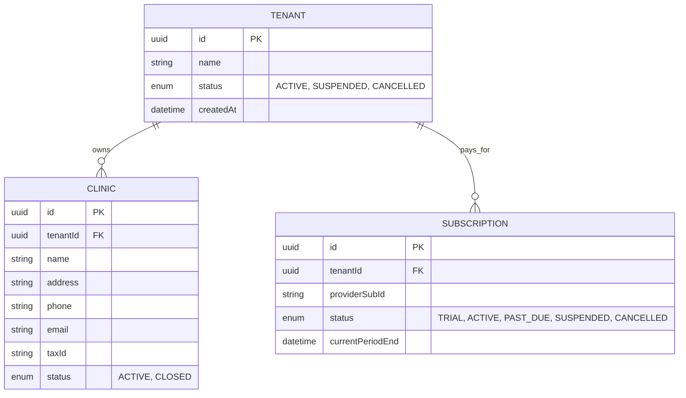
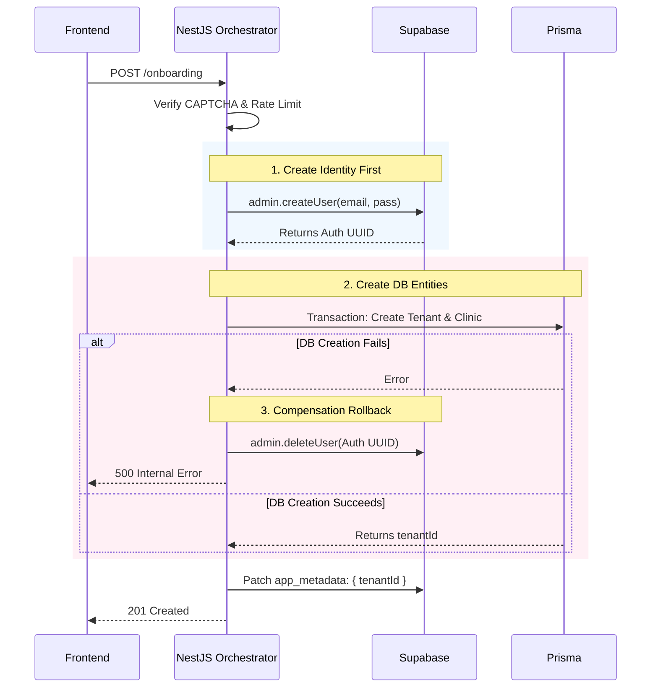
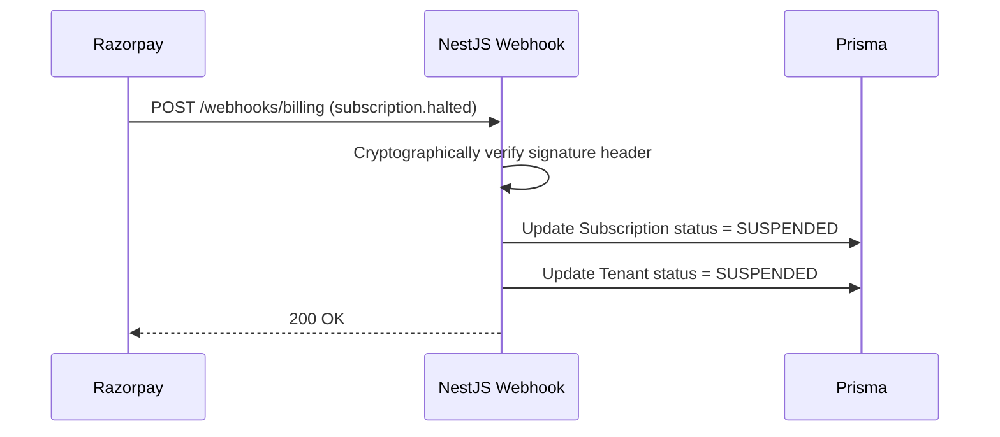
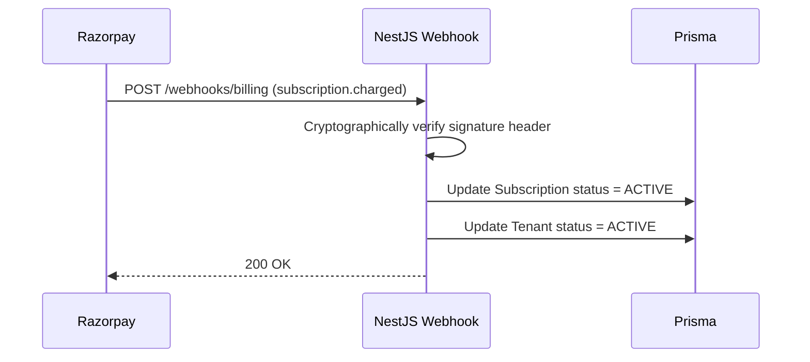

# STAGE 16B — Clinic Module Architecture (Remediated)

**Role:** Principal SaaS Architect
**Subject:** Clinic, Tenant, and Subscription Lifecycles
**Status:** Post-Audit Remediation

---

## 1. Tenant Lifecycle

The `Tenant` is the foundational root entity. It represents the billing and logical boundary for a single dental practice business.

*   **Creation:** Occurs during the initial founder onboarding.
*   **Activation:** The default state upon creation, granting full API access.
*   **Suspension:** Triggered asynchronously by a failed billing webhook. The Tenant remains in the database, but all API requests containing its ID are blocked with `402 Payment Required`.
*   **Reactivation:** Triggered by a successful billing webhook after a past-due payment is settled.
*   **Cancellation:** Explicitly requested by the Head Dentist. The Tenant is marked `CANCELLED`. Access is revoked immediately at the end of the billing cycle, but clinical data is retained for 7 years to comply with medical regulations.

## 2. Clinic Lifecycle

A `Clinic` represents a physical, brick-and-mortar location. One `Tenant` can own multiple `Clinics`.

*   **Onboarding:** The primary clinic is created simultaneously with the `Tenant` during sign-up.
*   **Profile Updates:** Staff with `UPDATE:CLINIC` permissions can modify the address, phone number, and tax details.
*   **Ownership:** A Clinic intrinsically belongs to a single Tenant. It cannot be reassigned.
*   **Status Management:** A Clinic can be marked `ACTIVE` or `CLOSED` independent of the Tenant (e.g., if a franchise owner shuts down one branch but keeps others open).

## 3. Subscription Lifecycle

Managed securely via external payment gateway (e.g., Razorpay) webhooks.

*   **TRIAL:** Active for 14 days post-onboarding.
*   **ACTIVE:** The clinic is in good financial standing.
*   **PAST_DUE:** A payment failed. A grace period (e.g., 3 days) is active. The Tenant is still active but warned.
*   **SUSPENDED:** The grace period expired. The Tenant is locked.
*   **CANCELLED:** The customer explicitly terminated the contract.

---

## 4. Multi-Tenant Security

1.  **Isolation Strategy:** The `tenantId` is completely untrusted if sent from the frontend. It is exclusively extracted from the Supabase JWT `app_metadata` and injected into `AsyncLocalStorage`.
2.  **Cross-Tenant Attack Prevention:** Prisma's `$allOperations` extension reads the `tenantId` from `AsyncLocalStorage` and automatically appends `WHERE tenantId = ...` to every database query.
3.  **Authorization Rules:** A global `TenantStatusGuard` intercepts all requests. If `Tenant.status === 'SUSPENDED'`, it throws a `402 Payment Required`.
4.  **Onboarding Protection:** The `POST /api/onboarding` endpoint is protected by aggressive IP rate-limiting (e.g., 3 requests per hour per IP) and a reCAPTCHA token to prevent malicious database exhaustion via automated spam.

---

## 5. Database Design

*   **Constraints:** `Clinic.tenantId` and `Subscription.tenantId` must reference a valid `Tenant.id`.
*   **Indexes:** B-Tree index on `tenantId` across all child tables to optimize the RLS read queries.

---

## 6. API Contracts

### `POST /api/onboarding`
*   **Payload:** `{ email, password, clinicName, phone, captchaToken }`
*   **Validation:** `@IsEmail`, Password regex, `@IsString`, `@IsNotEmpty`.
*   **Response:** `201 Created`
*   **Error:** `429 Too Many Requests` (Rate limit), `400 Bad Request` (Invalid captcha).

### `POST /api/clinics` (New Branch Creation)
*   **Payload:** `{ name, address, phone, email, taxId }`
*   **Response:** `201 Created`
*   **Security:** Requires `@RequirePermissions({ action: 'CREATE', subject: 'CLINIC' })`.

### `GET /api/clinics/:id` (Read Single)
*   **Response:** `200 OK`
*   **Security:** The queried Clinic's `tenantId` must inherently match the JWT's `tenantId` via Prisma ALS. Throws `404 Not Found` if attempted cross-tenant access.

### `PATCH /api/clinics/:id`
*   **Payload:** `{ address, phone }`
*   **Response:** `200 OK`

### `POST /api/billing/cancel`
*   **Payload:** `{ reason }`
*   **Response:** `200 OK`. Transitions Subscription to `CANCELLED` at period end.

---

## 7. Sequence Diagrams

### 7.1. New Clinic Onboarding (With Race Condition Fix)

### 7.2. Tenant Suspension

### 7.3. Tenant Reactivation

---

## 8. Audit Checklist
- [x] **Security:** Onboarding is protected by CAPTCHA and rate-limiting. Webhooks verify cryptographic signatures.
- [x] **Scalability:** The `tenantId` B-Tree index guarantees fast multi-tenant reads as the DB grows.
- [x] **Data Integrity:** The Onboarding race condition is mitigated via a compensatory rollback mechanism (`deleteUser`).
- [x] **Compliance Readiness:** Tenant cancellation retains clinical data in a soft-deleted state to comply with healthcare data retention laws.
