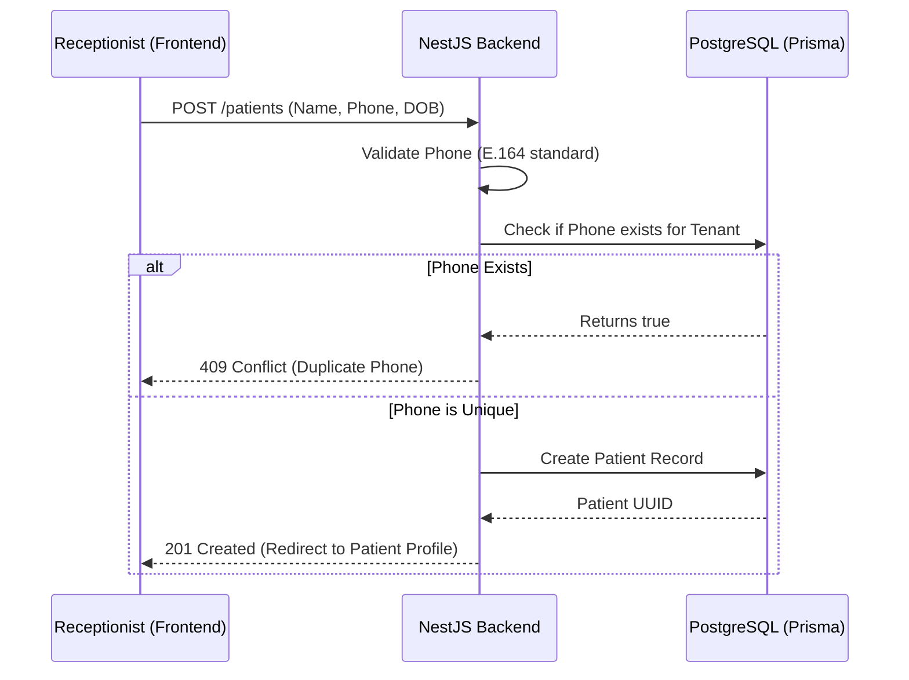
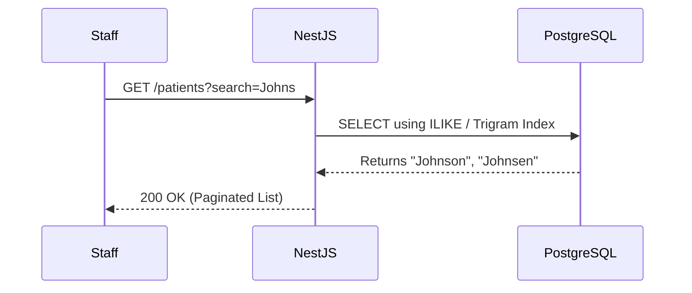
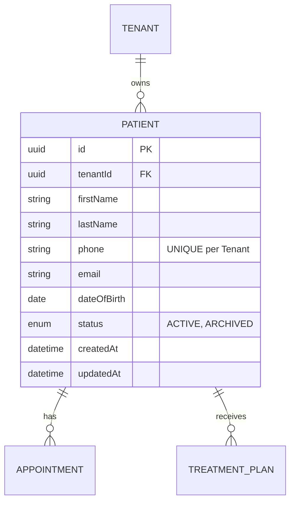

# STAGE 19 — Patient Module Architecture

**Role:** Principal SaaS Architect
**Subject:** Patient Data Management, Security, and Scalability
**Constraint:** Pure architectural blueprint (No implementation code).

---

## 1. Business Goals
The Patient Module is the core operational entity of DentalFlow. Its goals are:
*   **Centralization:** Provide a single source of truth for patient demographics and clinical history.
*   **WhatsApp Foundation:** Ensure perfectly formatted phone numbers (E.164 standard) to guarantee the downstream Meta API can instantly fire automated appointment reminders.
*   **Zero Data Leakage:** Ensure absolute multi-tenant isolation of Protected Health Information (PHI) to maintain strict HIPAA/SOC2 compliance.

## 2. User Workflows
*   **Intake:** A front desk receptionist manually enters a patient's details over the phone, or a patient completes a self-serve digital form (creating a "Pending" record).
*   **Review:** A dentist searches for the patient, pulls up their medical history, and attaches new treatment plans.
*   **Archival:** When a patient moves away, the clinic archives the record to clean up the active roster without destroying the legal audit trail.

---

## 3. Patient Creation Flow
*   **Decision:** We aggressively prevent duplicate phone numbers *per tenant* because WhatsApp automation relies on phone uniqueness.

## 4. Patient Search Flow
*   **Decision:** Dental clinic staff often misspell names or mishear phone numbers. We must use fuzzy matching rather than strict exact matching.

## 5. Patient Detail Flow
*   **Decision:** To prevent over-fetching, the base `GET /patients/:id` will only return demographics. Sub-modules (Appointments, Treatments) will be fetched via separate queries or explicit `?include=appointments` flags.

## 6. Patient Update Flow
*   **Decision:** Updates are partial (`PATCH`). If a phone number is updated, it must re-run the unique conflict check.

## 7. Patient Archive Flow
*   **Decision:** Patients are never hard-deleted (`DELETE` SQL command is forbidden). We set `status = 'ARCHIVED'` and timestamp `archivedAt` to maintain historical financial and clinical integrity.

## 8. Patient Merge/Duplicate Handling
*   **Decision:** If duplicates slip through (e.g., patient signs up online with an alternate email but same phone), the system requires a `POST /patients/merge` endpoint. It accepts a `sourceId` and `targetId`. All appointments/invoices tied to the `sourceId` are re-parented to the `targetId`, and the `sourceId` is permanently archived.

---

## 9. Validation Rules
*   **Phone Numbers:** Must strictly comply with E.164 format (e.g., `+14155552671`). Checked via regex/library.
*   **Dates:** Date of Birth must be in the past.
*   **Names:** Strip leading/trailing whitespaces automatically to prevent sorting bugs.

---

## 10. Database Design (ERD) & 11. Entity Relationships

---

## 12. APIs
*   `POST /patients` — Create new patient.
*   `GET /patients` — List/Search/Filter patients (Paginated).
*   `GET /patients/:id` — Read single patient profile.
*   `PATCH /patients/:id` — Update demographics.
*   `DELETE /patients/:id` — Soft archive patient.
*   `POST /patients/merge` — Merge duplicates.

---

## 13. Permissions Matrix
| Action | Endpoint | Required Permission | Allowed Roles |
| :--- | :--- | :--- | :--- |
| Read | `GET /patients` | `READ:PATIENT` | OWNER, ADMIN, STAFF |
| Create | `POST /patients` | `CREATE:PATIENT` | OWNER, ADMIN, STAFF |
| Update | `PATCH /patients/:id` | `UPDATE:PATIENT` | OWNER, ADMIN, STAFF |
| Archive| `DELETE /patients/:id`| `DELETE:PATIENT` | OWNER, ADMIN |
| Merge  | `POST /patients/merge`| `UPDATE:PATIENT` | OWNER, ADMIN |

*(Note: Standard STAFF cannot archive or merge patients to prevent accidental data loss).*

---

## 14. Audit Logging Requirements
*   **Mutation Tracking:** Every `POST`, `PATCH`, `DELETE`, and `MERGE` must be automatically logged by the `AuditLoggerInterceptor` noting the Actor (AuthID) and the Timestamp.
*   **Read Tracking (HIPAA Add-on):** Due to PHI compliance, reading a specific patient's chart (`GET /patients/:id`) should trigger an async read-log event, proving *who* looked at *whose* medical record and *when*.

---

## 15. Multi-Tenant Security Rules
*   **Strict Isolation:** No `tenantId` is accepted in the request body. Prisma's `$allOperations` extension reads it exclusively from the verified JWT via `AsyncLocalStorage`.
*   **ID Enumeration Protection:** Cross-tenant reads return `404 Not Found` rather than `403 Forbidden`.

---

## 16. Pagination Strategy
*   **Decision:** Standard Offset Pagination (Page/Limit). 
*   **Why:** Dental clinics typically have 1,000 to 15,000 patients. Offset pagination (using SQL `LIMIT` and `OFFSET`) performs perfectly well in this range and allows users to jump to specific pages, which front-desk staff often prefer. Keyset (cursor) pagination is overkill here.

---

## 17. Search Strategy & 18. Indexing Strategy
*   **Search Logic:** Use `OR` queries across `firstName`, `lastName`, and `phone` using case-insensitive (`mode: 'insensitive'`) matching.
*   **Indexing Decision:** 
    *   Compound B-Tree Index on `(tenantId, status)` for rapid primary filtering.
    *   Consider adding a PostgreSQL `pg_trgm` (trigram) GIN index on `firstName` and `lastName` if the clinic database grows substantially, allowing for highly performant fuzzy searching.

---

## 19. Error Handling Strategy
*   **`409 Conflict`:** Used specifically when a `POST` or `PATCH` attempts to save a phone number that already exists for another active patient in the same tenant.
*   **`400 Bad Request`:** Used when `class-validator` rejects a poorly formatted E.164 phone number.
*   **`404 Not Found`:** Returned when requesting an ID that doesn't exist *or* belongs to a different clinic.

---

## 20. Future Scalability Considerations
*   **Event-Driven Demographics:** Emitting a `PatientUpdatedEvent` allows us to eventually sync demographics to a third-party CRM or external analytics tool without slowing down the core API response.
*   **Caching:** Avoid caching the `GET /patients` list in Redis due to high churn and search variability. Instead, rely on efficient PostgreSQL indexing. Individual patient records (`GET /patients/:id`) could be cached if read-heavy, but real-time clinical accuracy is usually prioritized over microsecond latency gains.
