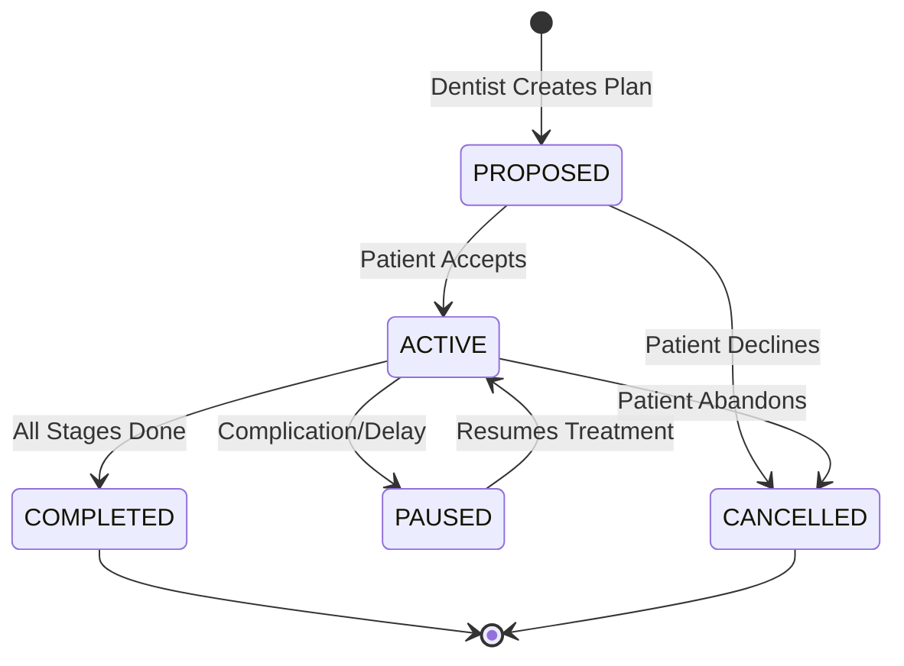
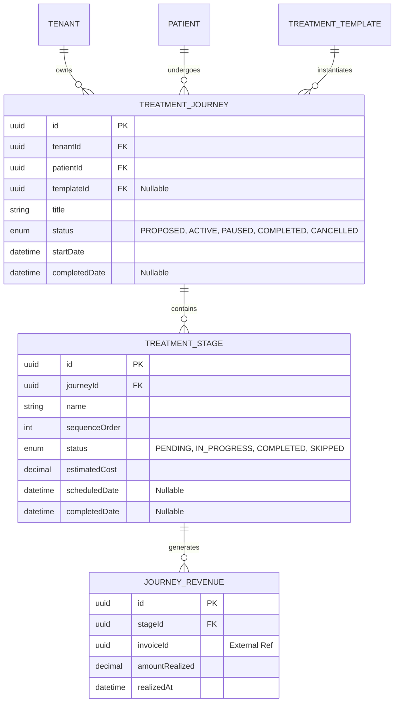

# STAGE 21 — Treatment Journey Module Architecture

**Role:** Principal SaaS Architect
**Subject:** Clinical Pathways, Revenue Mapping, and Patient Retention
**Constraint:** Pure architectural blueprint (No implementation code).

---

## 1. Business Goals
The Treatment Journey module represents the core clinical and financial lifecycle of a patient's care. Its goals are:
*   **Predictable Workflows:** Transform isolated appointments into coherent "Journeys" (e.g., a Root Canal requires: 1. Consultation, 2. Procedure, 3. Crown Fitting, 4. Follow-up).
*   **Revenue Forecasting:** Tie projected revenue to specific journey stages so clinics can forecast upcoming monthly cash flow based on pending treatment stages.
*   **Patient Retention:** Identify patients whose journeys are "stalled" (e.g., they completed stage 1 but never booked stage 2) to trigger automated WhatsApp reactivation campaigns.

---

## 2. User Flows
*   **Create Journey:** A dentist selects a `TreatmentTemplate` (e.g., "Invisalign") for a patient, which automatically spawns a `TreatmentJourney` with pre-populated `TreatmentStages`.
*   **Add Stages:** If the clinical reality deviates, the dentist manually injects custom stages into the active journey.
*   **Complete Stage:** As the patient checks out from an appointment, the receptionist marks the tied stage as `COMPLETED`, triggering the creation of an invoice and prompting the booking of the next stage.
*   **Pause Journey:** If a patient has financial difficulties or medical complications (e.g., pregnancy), the journey is marked `PAUSED` to halt automated reminders without abandoning the revenue.
*   **Cancel Journey:** The patient moves away or declines further treatment. Marked as `CANCELLED`, requiring a reason for analytics.
*   **Reopen Journey:** A `PAUSED` or `CANCELLED` journey is resumed when the patient returns.

---

## 3. Journey Lifecycle & 4. Stage Lifecycle & 5. Status Definitions

### Treatment Journey Lifecycle
*   `PROPOSED`: The treatment plan has been presented to the patient but not yet financially accepted.
*   `ACTIVE`: The patient has accepted the plan; stages are being executed.
*   `PAUSED`: Temporarily halted (medical/financial reasons).
*   `COMPLETED`: All stages finished successfully.
*   `CANCELLED`: Abandoned before completion.

### Treatment Stage Lifecycle
*   `PENDING`: Scheduled or waiting to be scheduled.
*   `IN_PROGRESS`: Currently being worked on (e.g., aligners ordered but not delivered).
*   `COMPLETED`: Clinically finished.
*   `SKIPPED`: Deemed medically unnecessary.

---

## 6. Revenue Tracking Design
Every `TreatmentStage` has an `estimatedCost`. As stages transition to `COMPLETED`, the system generates a `JourneyRevenue` record mapping the clinical completion to a financial invoice. By summing the `estimatedCost` of all `PENDING` stages within `ACTIVE` journeys, the clinic gets a real-time dashboard of "Pipeline Revenue".

## 7. Analytics Design
*   **Acceptance Rate:** Ratio of `ACTIVE` journeys to `PROPOSED` journeys.
*   **Drop-off Point:** Identifies which specific `TreatmentStage` has the highest rate of abandonment (e.g., patients frequently abandon implant journeys at the "Bone Graft" stage due to fear).
*   **Pipeline Velocity:** Average time (in days) a patient takes to transition from `PROPOSED` to `COMPLETED`.

---

## 8. Database Design & Entity Relationships

---

## 9. Multi-Tenant Security
*   **Strict Isolation:** The `tenantId` is stamped heavily at the root (`TreatmentJourney`). `TreatmentStage` and `JourneyRevenue` implicitly inherit this isolation through their parent relationships.
*   **Prisma Enforcement:** All read/write operations utilize the `$allOperations` Prisma extension, automatically injecting `tenantId` from the JWT's `AsyncLocalStorage` context into the `where` clause. Cross-tenant access is physically impossible at the ORM layer.

---

## 10. Validation Rules
*   **Sequential Integrity:** A stage with `sequenceOrder: 2` cannot be marked `COMPLETED` if `sequenceOrder: 1` is still `PENDING`.
*   **Financial Integrity:** `JourneyRevenue.amountRealized` cannot be negative.
*   **Lifecycle Constraints:** An `ACTIVE` journey cannot be marked `COMPLETED` if it still contains `PENDING` stages.

---

## 11. API Design
*   `POST /journeys` — Create a journey (optionally from a template).
*   `GET /journeys?patientId=...` — List journeys for a patient.
*   `GET /journeys/:id/stages` — Read specific stages.
*   `PATCH /journeys/:id/status` — Change journey status (Pause, Cancel, Complete).
*   `PATCH /stages/:id/complete` — Mark a stage complete and optionally post revenue.
*   `GET /analytics/pipeline` — Calculate pending revenue from `ACTIVE` journeys.

---

## 12. Edge Cases
*   **Orphaned Stages:** A user deletes a `TreatmentJourney`. **Fix:** The database uses `ON DELETE CASCADE` so `TreatmentStages` are automatically wiped to prevent orphan data.
*   **Retroactive Changes:** A dentist accidentally marks the wrong stage as `COMPLETED`. **Fix:** Allow reverting a stage back to `PENDING`, but this triggers a specific audit event and detaches the `JourneyRevenue` mapping.
*   **Currency Precision:** Storing `estimatedCost` as a float is dangerous due to IEEE 754 precision errors. **Fix:** Use `Decimal` (numeric) in PostgreSQL and Prisma to guarantee exact financial arithmetic.

---

## 13. Audit Logging Requirements
*   **Clinical Integrity:** Altering the status of a `TreatmentJourney` or `TreatmentStage` constitutes a modification to the patient's official medical chart. The `AuditLoggerInterceptor` must track `action: 'STATUS_CHANGE'`, the exact `stageId`, the previous status, the new status, and the `authId` of the staff member performing the change.

---

## 14. Future Scalability
*   **Automated Stage Progression:** In the future, when an Appointment is marked as "Checked Out", a webhook could automatically find the associated `TreatmentStage` and advance it to `COMPLETED`.
*   **Template Versioning:** As clinical protocols evolve, modifying a `TreatmentTemplate` must not retroactively alter existing `TreatmentJourneys` that were instantiated from the older version. This is why the `TreatmentStage` is a deep-copied instance rather than a direct relational view to the template.
