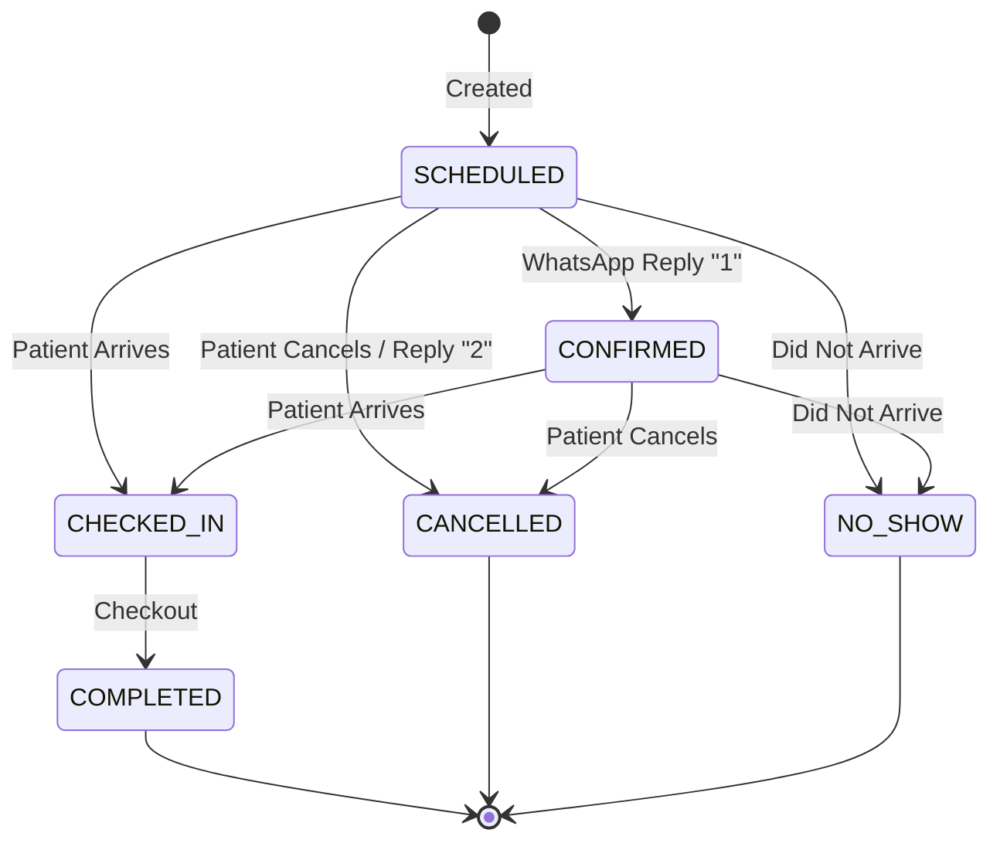
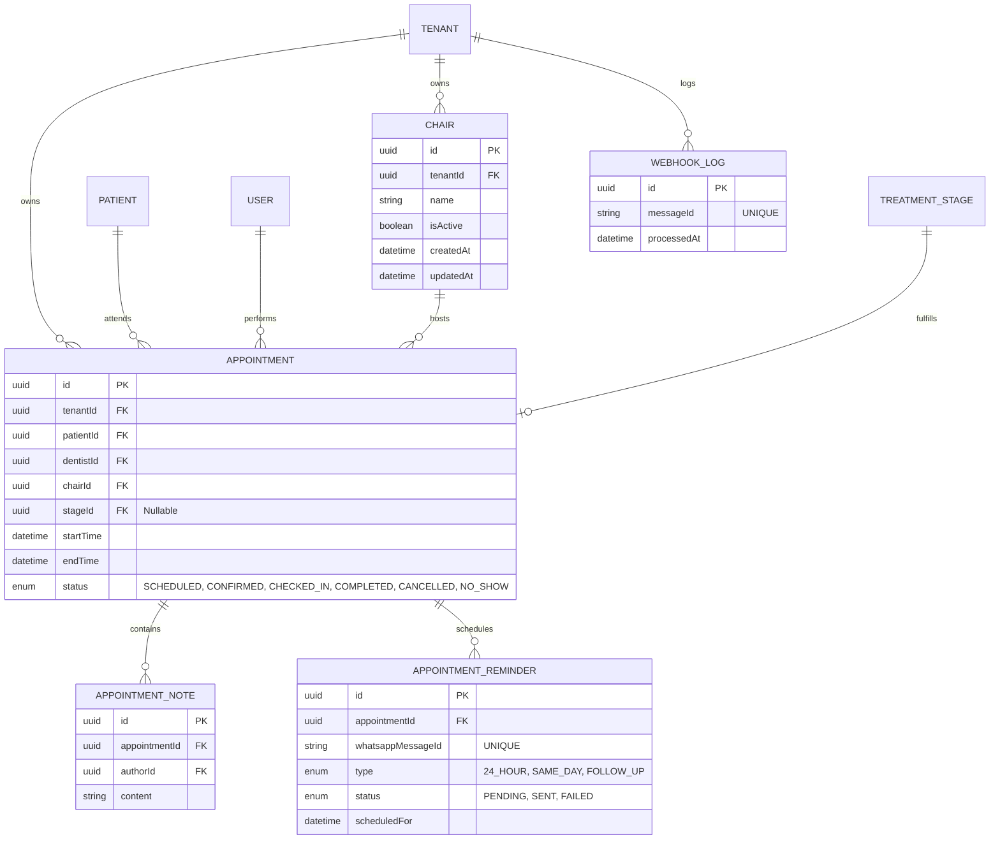

# STAGE 23 — Appointment Module Architecture (Remediated)

**Role:** Principal SaaS Architect
**Subject:** Scheduling, Clinical Operations, and WhatsApp Automation
**Constraint:** Pure architectural blueprint (No implementation code).

---

## 1. Business Goals
The Appointment Module is the operational heartbeat of the dental clinic. Its goals are:
*   **Operational Efficiency:** Completely eliminate double bookings and optimize physical "Chair Time" to maximize clinic revenue.
*   **No-Show Reduction:** Automatically trigger multi-stage WhatsApp reminders and instantly process patient replies to guarantee attendance.
*   **Clinical Cohesion:** Directly link an appointment to a specific `TreatmentStage`, ensuring the calendar reflects actual pipeline progress rather than just abstract time slots.

---

## 2. User Workflows
*   **Create Appointment:** Receptionist selects a Patient, a Dentist, a Chair, and a Time Slot. Optionally links it to a Treatment Stage.
*   **View Calendar:** Users toggle between Dentist-centric or Chair-centric visual layouts for daily/weekly overviews.
*   **Reschedule Appointment:** Changes the `startTime` and `endTime`. Restricted exclusively to `SCHEDULED` and `CONFIRMED` states to preserve historical data.
*   **Cancel Appointment:** Patient calls to cancel; receptionist updates status to free up the calendar slot instantly.
*   **Check-In Patient:** Patient arrives in the waiting room. Status changes to `CHECKED_IN`.
*   **Complete Appointment:** Patient checks out. Status becomes `COMPLETED`. If linked to a `TreatmentStage`, the system suggests marking the clinical stage as complete.
*   **WhatsApp Confirmation:** A patient receives an automated WhatsApp and replies "1" (Confirm) or "2" (Reschedule). The webhook parses the intent and modifies the appointment state instantly.

---

## 3. Appointment Lifecycle
Every appointment follows a strict state machine to maintain accurate analytics and reminder schedules.

### Status Transitions
*   `SCHEDULED`: The default state upon creation.
*   `CONFIRMED`: The patient replied "Yes" to the WhatsApp reminder or confirmed via phone.
*   `CHECKED_IN`: Patient is physically in the clinic waiting room.
*   `COMPLETED`: The clinical work is finished.
*   `CANCELLED`: Patient or clinic aborted the visit beforehand.
*   `NO_SHOW`: Patient did not arrive and did not cancel.

---

## 4. Calendar & Availability Engine
The frontend UI requires distinct perspectives and a robust mathematical engine to compute availability.

*   **Availability Endpoint (`GET /appointments/availability`):** 
    Takes `dentistId`, `chairId`, `startDate`, and `endDate`.
*   **Slot Generation Algorithm:**
    1. Load **Clinic Hours** (e.g., 9:00 AM - 5:00 PM).
    2. Subtract **Clinic Holidays** and exceptions.
    3. Load **Dentist Hours** (e.g., Dentist A works M/W/F).
    4. Calculate physical **Chair Availability**.
    5. Load and subtract all existing `SCHEDULED`, `CONFIRMED`, and `CHECKED_IN` appointments.
    6. Return unified arrays of `availableSlots`, `blockedSlots`, and `bookedSlots` broken into 15-minute or 30-minute intervals.

---

## 5. Database Design & Entity Relationships

### Database-Level Double Booking Protection
Application-level validation is insufficient under high load. We utilize native PostgreSQL Exclusion Constraints to mathematically eliminate double-booking at the disk level.
*   **Constraint Strategy:** Apply `EXCLUDE USING gist` on the `APPOINTMENT` table.
    *   *Rule A:* `EXCLUDE USING gist (dentistId WITH =, tsrange(startTime, endTime) WITH &&)`
    *   *Rule B:* `EXCLUDE USING gist (chairId WITH =, tsrange(startTime, endTime) WITH &&)`
*   **Migration Requirements:** Requires enabling the `btree_gist` PostgreSQL extension in the initial Prisma migration.
*   **Conflict Handling:** The database will throw a specific exception if a transaction attempts an overlap. The API catches this and returns a `409 Conflict: Time slot no longer available`.

---

## 6. Validation Rules
*   **Lifecycle Immutability:** Appointments with status `COMPLETED`, `CANCELLED`, or `NO_SHOW` are locked. Modifying the `startTime` or `endTime` (Rescheduling) is strictly limited to `SCHEDULED` and `CONFIRMED` states to protect historical accuracy.
*   **Past Date Restrictions:** Cannot create a `SCHEDULED` appointment where `startTime < now()`.
*   **Duration Validation:** `endTime` must be strictly greater than `startTime`.

---

## 7. Treatment Journey Integration
*   **Linking:** Mapping `stageId` to an appointment binds physical time to a clinical `TreatmentStage` (e.g., Stage 1: Bone Graft).
*   **Completion Impact:** Transitioning an appointment to `COMPLETED` emits an `AppointmentCompletedEvent`. A downstream listener auto-advances the `TreatmentStage` to `COMPLETED`, updating the financial pipeline instantly.

---

## 8. Reminder Architecture
An asynchronous worker utilizes an `APPOINTMENT_REMINDER` table to process outward communication.
*   **24-Hour Reminder:** Sent exactly 24 hours before `startTime`. Asks patient to reply "1" to Confirm or "2" to Reschedule.
*   **Same-Day Reminder:** A gentle nudge sent 2 hours before `startTime`.

### Sending Flow
1. BullMQ worker picks up a pending reminder.
2. The worker dispatches the template message to the WhatsApp Business API.
3. Meta returns a unique outbound message ID.
4. The worker persists this ID to `APPOINTMENT_REMINDER.whatsappMessageId`.

### WhatsApp Webhook Protocol
The system processes inbound patient replies via `POST /webhooks/whatsapp`.

*   **Idempotency & Replay Protection:**
    1. Extract inbound message ID: `payload.entry[0].changes[0].value.messages[0].id`.
    2. Attempt to store this ID in the `WEBHOOK_LOG` table (which has a unique constraint on `messageId`).
    3. If the insert fails (or is found in cache/Redis), the webhook is a duplicate. Reject it safely and return HTTP `200 OK` immediately.

*   **Deterministic Reply Flow:**
    1. Meta delivers webhook payload.
    2. Endpoint verifies the `X-Hub-Signature-256` payload against the local app secret using the raw byte buffer (`req.rawBody`).
    3. Extract the context ID representing the message the patient replied to: `payload.entry[0].changes[0].value.messages[0].context.message_id`.
    4. Resolve the appointment directly by querying `APPOINTMENT_REMINDER` where `whatsappMessageId` equals the context message ID.
    5. This bypasses all phone-number-based appointment matching, mathematically guaranteeing the correct `appointmentId` and `tenantId` are located, even if the patient shares a phone number across multiple clinics or has multiple future appointments.
    6. If reply is "1", the status transitions to `CONFIRMED`.
    7. If reply is "2", a notification alerts the front desk to call the patient for rescheduling.

---

## 9. Analytics Impact
Accurate states fuel the Operational Dashboard:
*   **Attendance Rate:** `(COMPLETED) / (Total Appointments - CANCELLED)`.
*   **No Show Rate:** `(NO_SHOW) / (Total Appointments - CANCELLED)`. High rates trigger automated workflows.
*   **Chair & Dentist Utilization:** Total hours `COMPLETED` vs. Operational hours available.

---

## 10. API Design

*   `POST /appointments` — Book a new slot.
*   `GET /appointments` — List/Filter appointments (Calendar View).
*   `GET /appointments/:id` — Detail view.
*   `PATCH /appointments/:id` — Modify non-schedule details.
*   `POST /appointments/:id/reschedule` — Explicit payload for moving time/chair.
*   `POST /appointments/:id/cancel` — Abort appointment.
*   `POST /appointments/:id/check-in` — Transition to `CHECKED_IN`.
*   `POST /appointments/:id/complete` — Transition to `COMPLETED`.
*   `GET /appointments/availability` — Slot generation engine.
*   `POST /appointments/:id/notes` — Add appointment notes.
*   `GET /appointments/:id/notes` — Read appointment notes.
*   `POST /webhooks/whatsapp` — Unauthenticated, signature-verified, idempotent Meta listener.

---

## 11. Permissions Matrix

| Action | Required Permission | Owner | Dentist | Receptionist |
| :--- | :--- | :---: | :---: | :---: |
| View Calendar (`GET`) | `READ:APPOINTMENT` | ✅ | ✅ | ✅ |
| Book Slot (`POST`) | `CREATE:APPOINTMENT` | ✅ | ✅ | ✅ |
| Reschedule | `UPDATE:APPOINTMENT` | ✅ | ✅ | ✅ |
| Alter Status | `UPDATE:APPOINTMENT` | ✅ | ✅ | ✅ |
| Manage Notes | `CREATE:APP_NOTE` | ✅ | ✅ | ✅ |

---

## 12. Multi-Tenant Security
*   **Tenant Isolation:** The `tenantId` is extracted from the JWT via `AsyncLocalStorage`. The Prisma `$allOperations` extension transparently intercepts queries, appending `WHERE tenantId = '...'`.
*   **SaaS Billing Protection:** Every mutation endpoint (`POST`, `PATCH`, `DELETE`) is protected by `TenantStatusGuard`. If the clinic's billing is suspended, the guard immediately throws a `403 Forbidden: No clinical changes allowed while subscription is suspended`.

---

## 13. Edge Cases
*   **Tenant Suspended:** As noted, mutations are locked entirely. Clinics can read schedules but cannot book.
*   **Patient Archived:** If a patient is archived (Stage 19), all their `SCHEDULED` and `CONFIRMED` future appointments automatically cascade to `CANCELLED` to free up slots immediately.
*   **Dentist/Chair Unavailable:** If an employee is terminated or a chair breaks, future appointments are flagged as "Orphaned" so the receptionist can rapidly reassign them.
*   **Journey Cancelled:** If a Treatment Journey is cancelled, any mapped future appointments are flagged for manual review.
*   **Concurrent Booking Attempts:** Two receptionists booking the exact same slot will trigger the PostgreSQL Exclusion Constraint, instantly failing one transaction with a `409 Conflict`.
*   **Patient Replies Late:** If a patient replies "1" to WhatsApp *after* the appointment is already `COMPLETED` or `CANCELLED`, the webhook safely ignores the status transition but logs the response.
*   **Duplicate Webhooks:** Meta occasionally sends duplicate webhook deliveries. The backend enforces idempotency using the `WEBHOOK_LOG` table by ignoring transitions if the inbound message ID has already been recorded.

---

## 14. Audit Logging Requirements
*   **Modification Tracking:** Changing the `startTime` or altering the `status` of an appointment triggers the `AuditLoggerInterceptor`. 
*   **Why:** In healthcare, if a patient claims they were not seen, the clinic must legally prove the exact timestamp the patient was marked `NO_SHOW` or `CHECKED_IN`, and by which specific staff member or automated system (Webhook).

---

## 15. Scalability Considerations
*   **Calendar Query Optimization:** A `GET /appointments` request spanning a month could return hundreds of records. A compound index on `(tenantId, startTime, endTime)` ensures an Index-Only Scan, keeping UI rendering latency under 50ms for 5,000 active clinics.
*   **Reminder Offloading:** The continuous polling for pending reminders utilizes a decoupled worker service (e.g., BullMQ), drastically reducing load on the primary API server.
