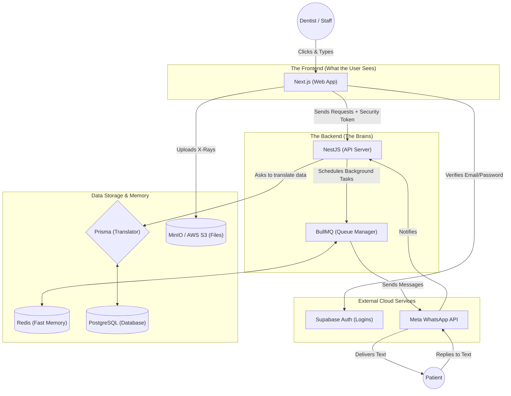

# DentalFlow System Map

**Subject:** Visualizing the complete platform for a non-technical founder.

---

## 1. The Big Picture

This diagram shows how all the pieces of software we are using talk to each other to make your clinic run.

---

## 2. How the Flows Work (In Plain English)

### 2.1. The Login Flow
**"How does a dentist get into the system securely?"**
1. The Dentist opens the website (**Next.js**) and types their email and password.
2. The website sends this directly to our security guard, **Supabase**.
3. Supabase checks the password. If it's correct, Supabase hands the website a special VIP badge (called a JWT token).
4. Now, every time the website asks the backend (**NestJS**) for data (like "Show me today's schedule"), it flashes that VIP badge. NestJS sees the badge is valid and allows the data through.

### 2.2. The Patient Creation Flow
**"How do we save a new patient's details and an X-Ray?"**
1. The receptionist types the patient's name into the website (**Next.js**) and attaches a picture of an X-Ray.
2. The website securely uploads the heavy X-Ray picture directly to our file storage (**MinIO/S3**) so it doesn't slow down our main server.
3. Then, the website tells the backend (**NestJS**): "Save John Doe, phone number, and here is the link to his X-Ray."
4. The backend uses its translator (**Prisma**) to neatly write John Doe's details into the permanent filing cabinet (**PostgreSQL**).

### 2.3. The Appointment Booking Flow
**"How does the clinic schedule a visit?"**
1. The receptionist clicks an open slot on the calendar (**Next.js**).
2. The website sends the booking details (Time, Date, Patient) to the backend (**NestJS**).
3. The backend saves the appointment in the database (**PostgreSQL**).
4. *Crucially*, the backend immediately says, "Hey, I need to text this patient a confirmation, but I don't want to wait around while WhatsApp loads." 
5. So, the backend throws a "Send WhatsApp Text" sticky note into a fast-moving bucket (**Redis** managed by **BullMQ**).

### 2.4. The WhatsApp Reminder Flow
**"How does the automated texting actually work?"**
1. **BullMQ** is constantly watching the **Redis** bucket for sticky notes. 
2. It grabs the sticky note created in the Appointment flow and says, "Time to text John Doe!"
3. BullMQ talks to the **Meta WhatsApp API**, handing over the message template: "Hi John, your appointment is confirmed for tomorrow at 2 PM."
4. Meta delivers the text to the patient's phone.
5. If the patient replies "Cancel", Meta instantly calls our backend (**NestJS**) to let us know. Our backend then automatically frees up the calendar slot in the database (**PostgreSQL**).
