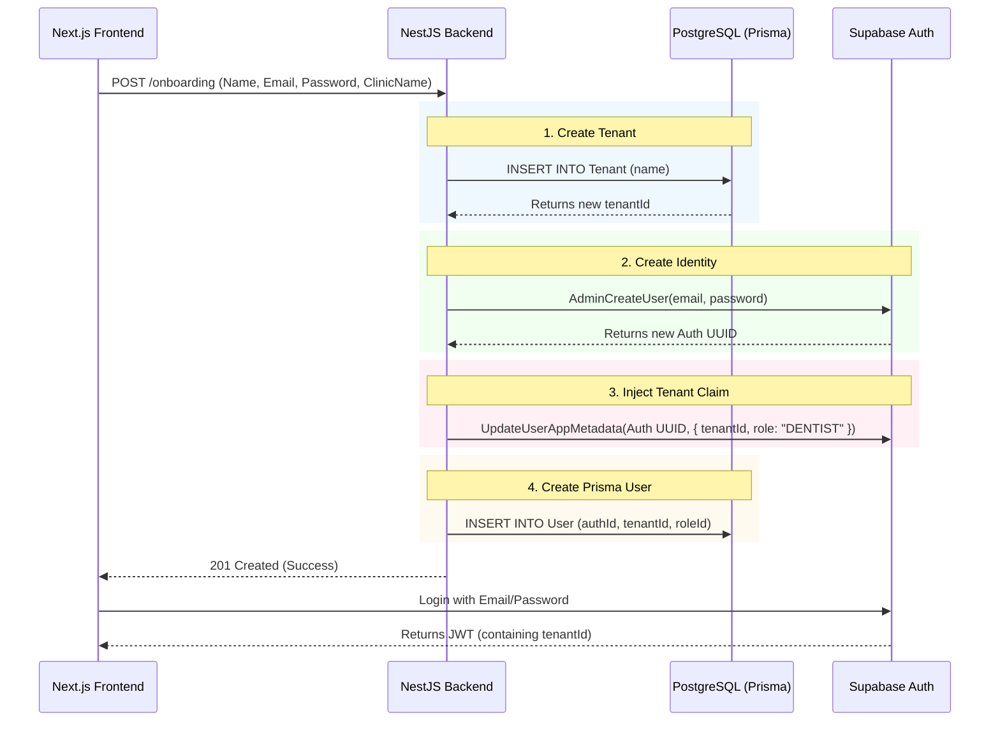
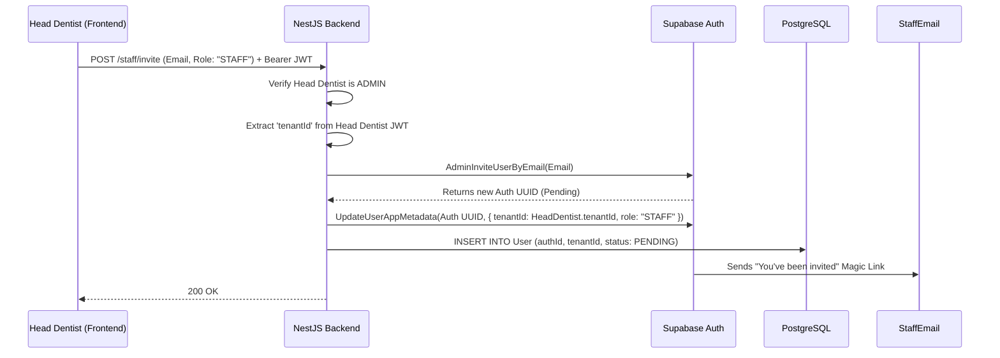
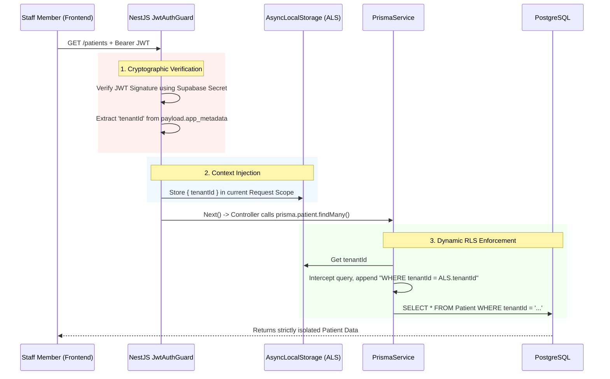

# Multi-Tenant Lifecycle & Security (Supabase + NestJS)

**Subject:** Deep Dive into the `tenantId` Lifecycle
**Goal:** Explain exactly how a `tenantId` is created, assigned to users via Supabase, and verified securely by NestJS.

---

## 1. JWT Claims Structure

Before looking at the flows, we must understand the payload. When Supabase generates a JWT for a logged-in user, the critical `tenantId` and `role` are embedded inside the `app_metadata` object.

```json
{
  "aud": "authenticated",
  "exp": 1719220000,
  "sub": "d98a7b64-1234-5678-abcd-ef0123456789", // Supabase User UUID
  "email": "dr.smith@dentalflow.co",
  "app_metadata": {
    "provider": "email",
    "providers": ["email"],
    "tenantId": "f47ac10b-58cc-4372-a567-0e02b2c3d479", // The Clinic's UUID
    "role": "DENTIST" // The User's Role
  }
}
```

*Note: `app_metadata` cannot be modified by the user on the frontend. It can only be updated securely by an Admin backend using the Supabase Service Role Key.*

---

## 2. Tenant & Clinic Owner Creation Flow

When a new dentist signs up for DentalFlow, we must create the Clinic (Tenant) and assign the founder as the Head Dentist.



---

## 3. Staff Invitation Flow

A Head Dentist (who already belongs to a `tenantId`) wants to invite a Receptionist.



---

## 4. Tenant Security Validation Flow

This is what happens when the Receptionist attempts to view a list of Patients.



---

## Summary of the `tenantId` Lifecycle

1.  **Creation:** The `tenantId` (UUID) is born in the PostgreSQL database when a new clinic subscribes.
2.  **Storage:** It is stored permanently in the `app_metadata` of the user's Supabase Identity vault.
3.  **Updating:** If a user moves clinics (rare), only a Super Admin using the Supabase Service Role Key can call the Supabase Admin API to update their `app_metadata.tenantId`. Users cannot change it themselves.
4.  **Verification:** NestJS never trusts the frontend. It verifies the signature of the Supabase JWT. Once verified, it extracts the `tenantId` and uses Node's `AsyncLocalStorage` to invisibly force that `tenantId` into every database query via Prisma's `$allOperations` extension.
