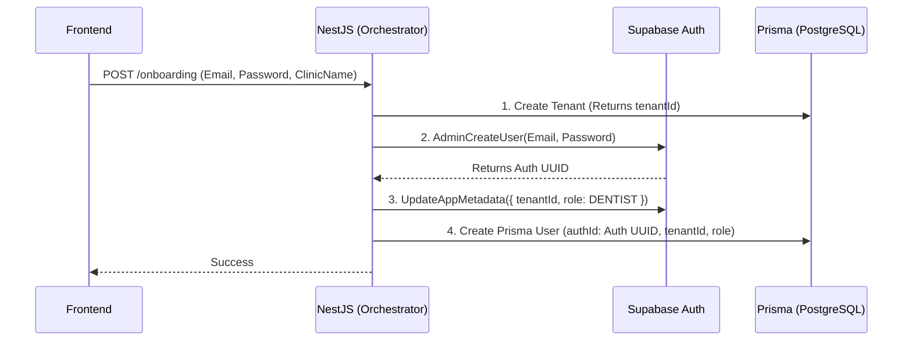
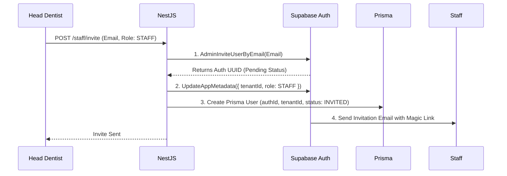
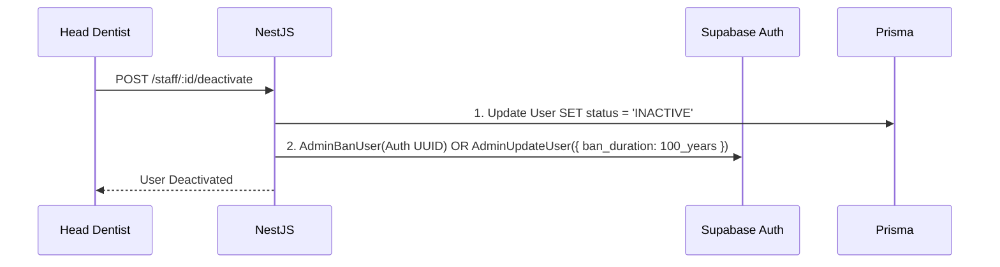
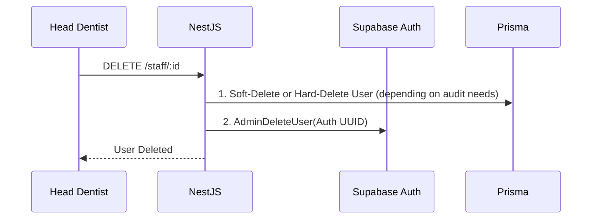
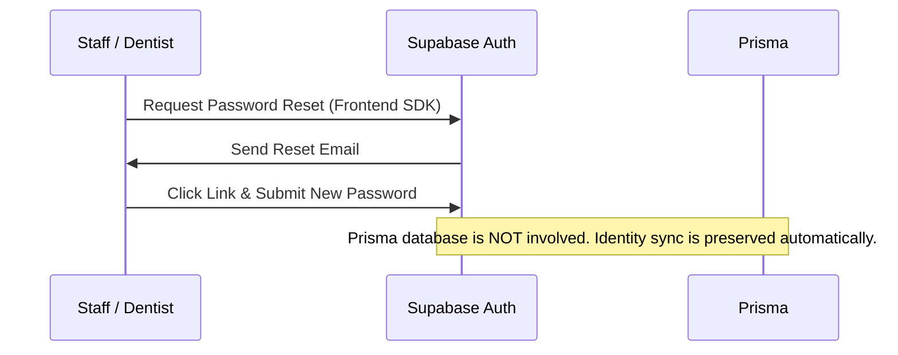
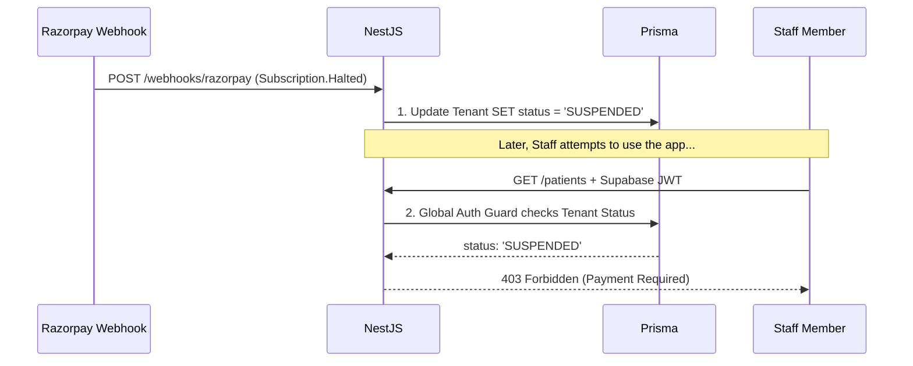

# User Entity Synchronization Strategy

**Subject:** Maintaining Consistency Between Supabase Identity and Prisma Database
**Context:** Because identity (Email, Password, Auth UUID) lives in Supabase, but business logic (Role, Tenant, Clinical Data) lives in PostgreSQL (via Prisma), these two systems must be kept perfectly synchronized.

---

## 1. Core Synchronization Principle

**NestJS is the Orchestrator.** 
We do *not* rely on Supabase Database Webhooks (Postgres Triggers calling out to NestJS) to keep the systems in sync. Webhooks can fail, leading to phantom users in Supabase that don't exist in Prisma. 

Instead, NestJS orchestrates the creation in both systems within a single API call using the Supabase Admin API.

---

## 2. Workflows & Sequence Diagrams

### 2.1. User Creation (Head Dentist Onboarding)
When a new clinic signs up, NestJS ensures the Tenant, Supabase User, and Prisma User are all created sequentially. If Supabase creation fails, the transaction rolls back.

### 2.2. Staff Invitation
The Head Dentist invites a receptionist.

### 2.3. User Deactivation (Firing Staff)
When staff is terminated, their access must be revoked immediately.

*Note: Banning the user in Supabase instantly invalidates their current session and prevents new logins.*

### 2.4. User Deletion (GDPR / Data Wipe)
To comply with data privacy laws, hard deletion removes the identity completely.

### 2.5. Password Reset
Because Supabase handles authentication, NestJS and Prisma are largely bypassed.

### 2.6. Clinic Suspension (SaaS Billing Failure)
If a clinic fails to pay their SaaS subscription via Razorpay, we must block access. However, iterating through 50 staff members in Supabase to ban them individually is inefficient.

Instead, we manage suspension at the **Tenant** level in Prisma.

*Note: The Supabase user remains "Active" and can log in, but every API call they make to NestJS will be rejected with a `403 Payment Required` until the Tenant status is restored to `ACTIVE`.*
