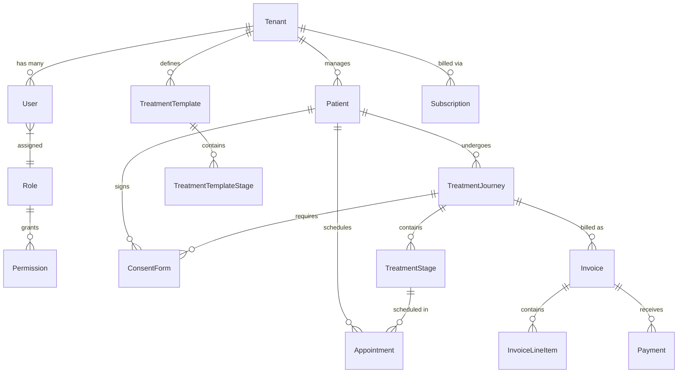

# Final Database & ER Design

**Version:** 2.0 (Post-Audit Consolidation)
**Subject:** Entity-Relationship Definitions for DentalFlow

---

## 1. Core Principles
*   **Database:** PostgreSQL.
*   **Multi-tenancy:** Logical isolation via a `tenantId` UUID column on every business-domain table.
*   **Soft Deletes:** `deletedAt` DateTime column to ensure data recovery.
*   **Audit Fields:** `createdAt`, `updatedAt`, `createdBy`, `updatedBy`.

---

## 2. Updated Entity-Relationship Diagram



---

## 3. Newly Added Entities (Post-Audit)

Based on the Principal Architect's review, the following entities have been formally added to the schema.

### 3.1. `Permission` & Granular RBAC
Allows for fine-grained control beyond simple `DENTIST` and `STAFF` roles.

```prisma
model Permission {
  id          String   @id @default(dbgenerated("gen_random_uuid()")) @db.Uuid
  roleId      String   @db.Uuid
  action      String   // e.g., "CREATE_PATIENT", "VIEW_REVENUE", "DELETE_INVOICE"
  subject     String   // e.g., "Patient", "Invoice"
  
  role        Role     @relation(fields: [roleId], references: [id])
}
```

### 3.2. `ConsentForm` (Clinical Compliance)
Maps to S3 bucket uploads. Crucial for legal compliance before beginning stages like Extractions.

```prisma
model ConsentForm {
  id                 String           @id @default(dbgenerated("gen_random_uuid()")) @db.Uuid
  tenantId           String           @db.Uuid
  patientId          String           @db.Uuid
  treatmentJourneyId String           @db.Uuid
  
  documentUrl        String           // Pre-Signed S3 Upload Destination URL
  signedAt           DateTime
  
  createdAt          DateTime         @default(now())
  deletedAt          DateTime?
  
  @@index([tenantId, patientId])
}
```

### 3.3. `Invoice` & `InvoiceLineItem` (Financial Granularity)
Replaces the simplistic `amountPaid` column on the Journey table, allowing for partial payments, taxation, and formal billing records.

```prisma
model Invoice {
  id                String           @id @default(dbgenerated("gen_random_uuid()")) @db.Uuid
  tenantId          String           @db.Uuid
  patientId         String           @db.Uuid
  journeyId         String           @db.Uuid
  
  invoiceNumber     String           // e.g., INV-2026-001
  subtotal          Decimal
  tax               Decimal
  totalAmount       Decimal
  amountPaid        Decimal
  status            InvoiceStatus    // PENDING, PARTIALLY_PAID, PAID
  
  lineItems         InvoiceLineItem[]
  payments          Payment[]
  
  createdAt         DateTime         @default(now())
  deletedAt         DateTime?
  
  @@index([tenantId, patientId])
}

model InvoiceLineItem {
  id                String           @id @default(dbgenerated("gen_random_uuid()")) @db.Uuid
  invoiceId         String           @db.Uuid
  description       String           // e.g., "Root Canal - Stage 1"
  amount            Decimal
  
  invoice           Invoice          @relation(fields: [invoiceId], references: [id])
}
```
