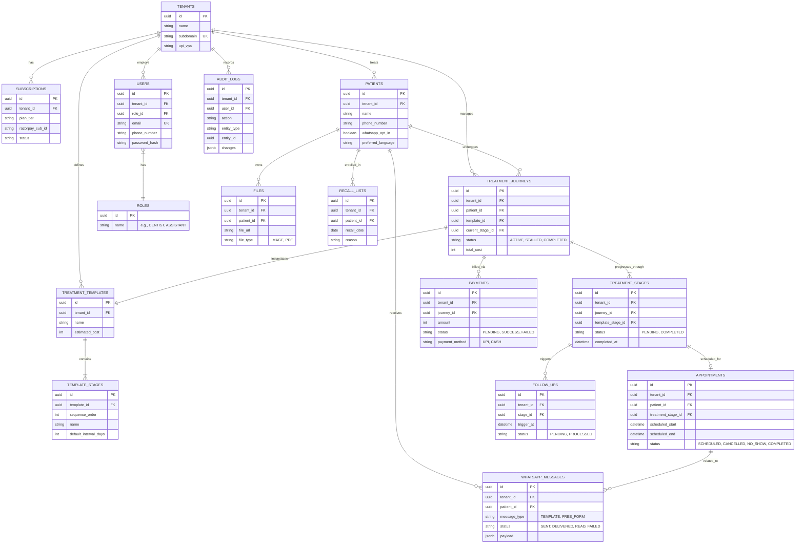

# Database Entity-Relationship (ER) Diagram

This document provides a high-level visual representation of the core data entities and their relationships within the DentalFlow system. 

The schema is built around the `Tenant` (Clinic) as the root boundary for almost all tables to enforce Row-Level Security (RLS).

---

## Core Schema ER Diagram

