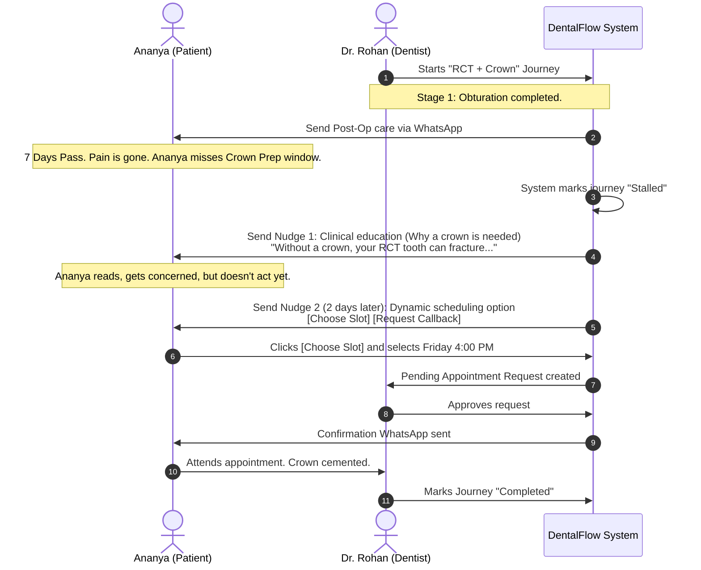

# User Journeys - DentalFlow

This document presents three key user journeys within DentalFlow, illustrating how the platform’s WhatsApp-first and treatment-centric approach recovers revenue, automates clinic operations, and improves the clinical completion rate.

---

## Journey 1: The Patient Drop-off Recovery (RCT-to-Crown)

### **Actors:**
* **Patient:** Ananya Hegde (26, Software Engineer in Mangalore, speaks English and Kannada).
* **Dentist:** Dr. Rohan Shenoy.
* **System:** DentalFlow Automation.

### **The Scenario:**
Ananya visits the clinic with severe pulpitis (toothache). Dr. Rohan diagnoses her and starts a Root Canal Treatment (RCT). After the obturation stage, Ananya's pain completely disappears. Feeling cured, she neglects to book or return for the final crown (cap) placement. 



### **Step-by-Step Experience:**

1. **Initiation:** Dr. Rohan sets up the "RCT + Crown" journey for Ananya on DentalFlow. Stage 1 (Cleaning/Obturation) is checked off. 
2. **Post-Op Delivery:** Ananya immediately receives a WhatsApp message in Kannada/English detailing post-op instructions (e.g., "Do not eat hard food on the left side").
3. **The Stall:** After 7 days, Ananya has not scheduled her Stage 2 (Crown Prep & Impression) appointment. The system automatically shifts her journey status to **Stalled**.
4. **Contextual Nudge 1 (Educational):** The system triggers a pre-approved template: 
   > *"Hi Ananya, hope your tooth is feeling fine! 🦷 While your pain is gone, your root canal treatment is only 70% complete. Without a dental crown, the tooth is weak and can split under normal chewing, which might require an extraction. Let's get that crown fitted!"*
5. **Contextual Nudge 2 (Actionable):** 48 hours later, she receives:
   > *"Hi Ananya, let's secure your tooth. Tap below to select an appointment slot for your crown prep this week."*
   > * **[Book Friday Afternoon]**
   > * **[Book Saturday Morning]**
   > * **[Request Callback]**
6. **Conversion:** Ananya taps **[Book Friday Afternoon]**. DentalFlow registers the request and notifies the clinic.
7. **Resolution:** The receptionist approves the slot. Ananya receives a confirmation message. She arrives, gets the crown prepped, and the journey moves to completion.

---

## Journey 2: The Clinic Assistant's Daily Dashboard Flow

### **Actors:**
* **Assistant:** Shaila D'Souza (Receptionist/Assistant at Shenoy Dental Clinic).
* **System:** DentalFlow Web Dashboard.

### **The Scenario:**
Shaila manages front-desk operations, sanitization, patient registration, and reminders. She needs to identify which patients need scheduling action without reading through pages of patient charts.

```
+-----------------------------------------------------------------------+
|  DentalFlow Dashboard                                    [Leave Mode] |
|                                                                       |
|  [Next Visit Feed (3)]                       [Appt Requests (1)]      |
|  1. Suresh K. (Needs Crown Cementation)       1. Deepa M. (Sat 11 AM)  |
|     - Last stage done: 10 days ago              [Approve] [Decline]   |
|     [Nudge via WhatsApp]                                              |
|                                                                       |
|  2. Vignesh R. (Needs Ortho Adjustment)                               |
|     - Last stage done: 32 days ago                                    |
|     [Nudge via WhatsApp]                                              |
+-----------------------------------------------------------------------+
```

### **Step-by-Step Experience:**

1. **Morning Scan:** Shaila logs into the desktop dashboard. She immediately goes to the **Next Visit Feed**.
2. **Actioning Stalled Patients:**
   * She sees Suresh K., who completed "Crown Impression" 8 days ago but hasn't booked "Crown Cementation".
   * She clicks **[Nudge via WhatsApp]**. The system sends a pre-filled, localized template with booking options.
3. **Approving Incoming Requests:**
   * Under the **Appointment Requests** column, she sees a request card from Deepa M., who selected Saturday at 11:00 AM via an automated WhatsApp reminder.
   * Shaila checks the calendar grid, sees the slot is free, and clicks **[Approve]**. The slot is booked, and a confirmation goes to Deepa via WhatsApp.
4. **Chair-Side Check-Off:**
   * A patient, Vignesh, finishes his Orthodontic adjustment. 
   * Shaila clicks on Vignesh’s profile, selects his active "Orthodontic Journey", and clicks **[Complete Stage 4 (Alignment Check)]**.
   * The app prompts: *"Total Balance: ₹12,000. Collect stage payment of ₹2,000?"*
   * She clicks **[Yes, Paid]** and generates the UPI QR code on the desktop screen. Vignesh scans it with GPay, pays, and Shaila marks it confirmed.
   * DentalFlow automatically cues the next adjustment reminder for 28 days later.

---

## Journey 3: The Solo Dentist Mobile Web Experience

### **Actors:**
* **Dentist:** Dr. Rohan Shenoy (operating out of his single-chair practice between procedures).
* **System:** DentalFlow mobile-responsive PWA.

### **The Scenario:**
Dr. Rohan does not have a receptionist. He does all clinical and administrative work himself. He relies on his phone to manage his clinic on the go.

### **Step-by-Step Experience:**

1. **On-the-Go Review:** During a 10-minute break, Dr. Rohan opens `shenoy.dentalflow.in` on his smartphone browser.
2. **Performance Check:** He checks the dashboard:
   * **Treatment Completion Rate:** 88% (Up from 74% since launching DentalFlow).
   * **Revenue Recovered This Month:** ₹24,500 (from 8 stalled patients who returned after automated WhatsApp nudges).
3. **Quick-Enroll Patient:** 
   * A patient, Mrs. Kamila, decides to go ahead with a Dental Implant. 
   * Dr. Rohan clicks the **[+]** floating action button on his mobile screen.
   * He selects "New Patient", inputs *Kamila, 98450xxxxx, English/Kannada*, and clicks **[Start Journey]**.
   * He selects the "Dental Implant (Multi-Stage)" template.
   * He marks Stage 1 (Surgical Implant Placement) as completed today, inputs the surgical fee received, and clicks save.
4. **Automated Queueing:** Without any further input, the system schedules a WhatsApp follow-up sequence:
   * Post-op care instructions sent 2 hours post-surgery.
   * Suture removal appointment reminder sent 7 days post-surgery.
   * Abutment integration check scheduled for 3 months later.
5. **Peace of Mind:** Dr. Rohan locks his phone and focuses on his next patient, knowing the communication for the next 3 months is fully automated.
