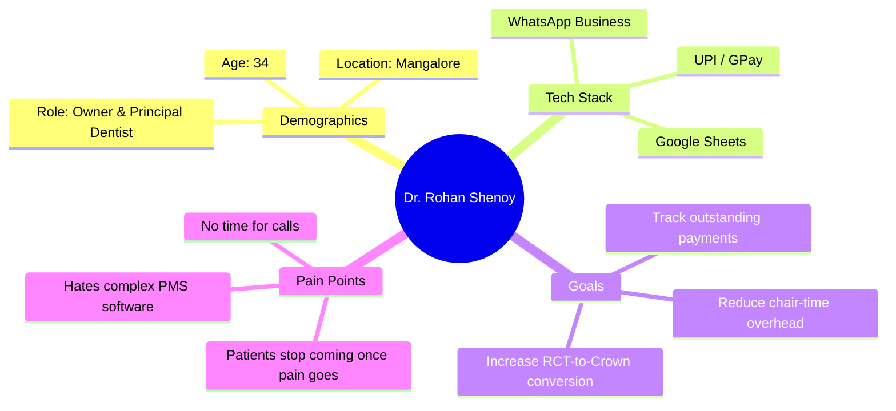

# Product Vision & User Personas

This document defines the high-level vision, target market, core philosophy, and user personas for **DentalFlow** — a WhatsApp-first treatment completion, follow-up automation, patient retention, and revenue recovery SaaS for Indian dental clinics.

---

## 1. Product Vision

### The Problem in Indian Dental Practice
In India, and particularly in tier-2 hubs like Mangalore, the majority of dental practices are solo practices or small clinics (1-2 chairs). 
* **High Drop-off Rates:** Dental treatments are rarely single-visit events. Multi-stage procedures (such as Root Canal Treatments (RCT) + Crowns, Dental Implants, Orthodontics, and Full-Mouth Reconstructions) have massive patient drop-off rates after the initial pain-relief phase.
* **Appointment-Centric Software Failure:** Existing practice management softwares (PMS) focus almost exclusively on scheduling appointments and managing inventory. They do not track the *clinical journey* or nudge the patient based on their specific treatment status.
* **Manual Overhead:** Receptionists or solo dentists must manually call or text patients to follow up. This is time-consuming, inconsistent, and often feels intrusive or administrative.
* **WhatsApp Dominance:** Over 95% of patients in India communicate via WhatsApp. SMS goes unread, email is virtually ignored for dental care, and direct phone calls are frequently declined.

### The Solution: DentalFlow
DentalFlow is a **WhatsApp-first, journey-centric SaaS** designed to automate treatment completion, follow-ups, patient retention, and revenue recovery. It shifts the clinic's operating model from "Who has an appointment tomorrow?" to "**Which patient is stalling in their treatment journey, and how do we get them to completion?**"

By automating hyper-personalized, contextual WhatsApp nudges, DentalFlow ensures that patients complete their clinical pathways, leading to:
1. Better clinical outcomes for patients.
2. Significant revenue recovery for clinics (recapturing "lost" second/third visits).
3. Higher patient retention rates and lifetime value.

---

## 2. Core Philosophy

DentalFlow is built on a strict hierarchical data and operational model:

$$\text{Patient} \longrightarrow \text{Treatment Journey} \longrightarrow \text{Treatment Stage} \longrightarrow \text{Appointment}$$

Unlike traditional software where the "Appointment" is the root node:
1. **Patient:** The individual receiving care.
2. **Treatment Journey:** The overall clinical goal (e.g., "3-Unit Bridge on 36-38" or "Clear Aligner Treatment").
3. **Treatment Stage:** The milestone phases of that journey (e.g., Stage 1: Tooth Prep & Impression $\rightarrow$ Stage 2: Metal Trial $\rightarrow$ Stage 3: Final Cementation).
4. **Appointment:** A transactional event linked to a specific stage to move the journey forward. If an appointment is cancelled, the *journey* remains active and triggers follow-up protocols until the stage is completed.

---

## 3. Target Market

* **Geographic Focus:** India, with a launch focus on **Mangalore** (a major medical and dental education hub with a high density of private clinics).
* **Clinic Types:**
  * **Solo Dentists:** Practitioners running a single-chair clinic completely on their own, handling clinical work, billing, and patient communication.
  * **Small Clinics:** 1-2 chair practices with a single receptionist or clinic assistant.
* **Key Constraints:**
  * Low tolerance for complex desktop software.
  * Extreme reliance on mobile devices.
  * Clinic staff (assistants) often have limited English proficiency or technical training.
  * Extremely price-sensitive but highly appreciative of direct revenue impact.

---

## 4. User Personas

### Persona 1: The Busy Practitioner (Solo Dentist)

* **Name:** Dr. Rohan Shenoy
* **Profile:** Graduated from a top dental college in Mangalore. Runs "Shenoy Dental Clinic" in Kadri, Mangalore. Handles about 15-20 patients a day.
* **Behavior & Habits:**
  * Spends 90% of his day chair-side with gloved hands.
  * Uses WhatsApp Web on his clinic PC between patients to coordinate with labs and message patients.
  * Manages clinical records on a physical register or a basic Excel/Google sheet.
* **Goals:**
  * Prevent patients from dropping off after the first stage of Root Canal Treatment (once pain disappears).
  * Automate post-op care instructions so patients don't call him during family hours.
  * Keep track of outstanding balances for multi-stage treatments.
* **Key Pain Points:**
  * "I lose thousands of rupees every month because patients skip their crown appointments after their RCT is done. I feel awkward calling them myself to ask them to return."
  * "Traditional software takes too many clicks. I don't have a dedicated receptionist to feed data all day."

---

### Persona 2: The Multi-Tasking Assistant (Clinic Receptionist)

* **Name:** Shaila D'Souza
* **Profile:** High-school graduate. Works as the sole receptionist/assistant at a 2-chair clinic. 
* **Behavior & Habits:**
  * Manages walk-ins, cleans instruments, answers the phone, handles billing, and serves coffee.
  * Constantly interrupted.
  * Uses WhatsApp on her personal phone for hours daily; very comfortable with chat but struggles with complex ERP/database UIs.
* **Goals:**
  * Keep the daily schedule organized without errors.
  * Swiftly send appointment reminders and coordinate next visits.
  * Collect pending payments at the front desk before the patient walks out.
* **Key Pain Points:**
  * "When the clinic gets busy, I forget to write down who needs their next visit scheduled. Patients leave, and we lose track of them."
  * "Typing out long WhatsApp reminders to 30 patients every evening takes me an hour after clinic closing time."
